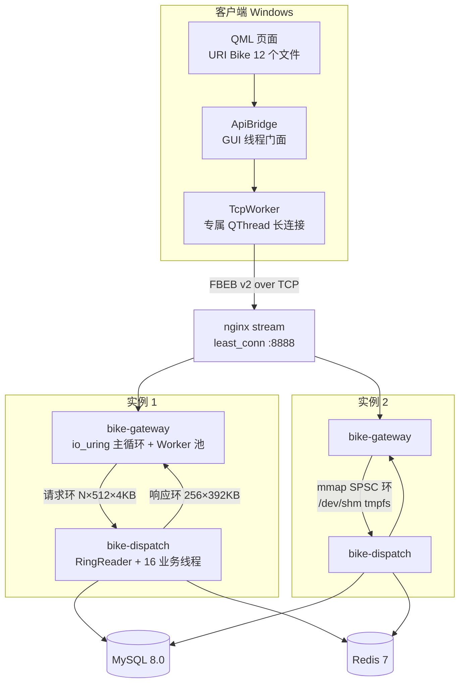

# shared_bike_refactor

C++20 共享单车系统：**Qt6 QML 桌面客户端** + **高性能 C++ 后端**（io_uring 网关 + Dispatch 业务进程双进程架构），MySQL + Redis 持久化，Docker 部署于云服务器，nginx stream 代理对外暴露公网端口 **8888**。

本仓库是从 legacy C++03 实现（libevent + protobuf + log4cpp，保留于 `legacy/` 供对照）整体重构而来的现代实现。

## 特性亮点

**后端**

- **io_uring Proactor 网关**：单主循环 + 固定 Worker 池，常驻线程数与连接数无关；空闲连接 60s 自动回收，优雅停机 drain 在途请求。
- **双进程拆分**：`bike-gateway`（纯接入/切帧/协议解析）与 `bike-dispatch`（全部业务逻辑）经 `/dev/shm` 上的 **mmap SPSC 无锁环 + FIFO 通知** 协同；`[ipc].mode="inprocess"` 可一键回退单进程形态。
- **零拷贝 IPC**：请求环 512×4KB/环（每 worker 一环）、响应环 256×392KB 单环；head/tail 分缓存行消除伪共享；心跳判活 + compose 自动重拉实现故障自愈。
- **完整骑行闭环**：验证码/登录 → 充值/余额/账单 → 附近车辆（稀疏区域动态投放 `DY-` 车）→ 扫码解锁 → 每秒位置上报（轨迹点积累）→ 结束计费（沿轨迹逐段 haversine 里程 + 时间计费）→ 历史列表与轨迹回放。
- **性能实测**：**16,733 QPS @ c500，P99 ≈ 42ms，0 错误**（云端 docker compose 双实例栈压测，工具 `scripts/bench/bike_bench.py`）。

**客户端**

- Qt6 QML 桌面端（Windows 全功能）：`TcpWorker` 专属线程长连接 + 指数退避重连 + 坏帧自愈；`ApiBridge` GUI 线程门面，per-eid 单飞去重、断线在途请求失败广播。
- WebEngine 内嵌 Leaflet 地图（高德瓦片）：附近车辆渲染、骑行轨迹实时跟随、历史订单轨迹回放。
- 常驻订阅式定位（2s 周期 `QGeoPositionInfoSource`），骑行中每秒模拟轨迹推进并 fire-and-forget 上报。

**协议**

- 自定义二进制帧协议 **FBEB v2**：`"FBEB"(4) + eid u16 LE + seq u32 LE + len i32 LE + protobuf payload`，事件号枚举单一事实来源（23 个事件常量，见 `common/include/bike/protocol.hpp`）。

## 架构总览



## 目录结构

```
├── common/            # 共享静态库 bike_common: FBEB 协议编解码、计费、地理、校验
│   ├── include/bike/  #   protocol.hpp(事件号单一事实来源) / pricing.hpp / geo.hpp ...
│   └── tests/         #   5 个 ctest 套件
├── server/            # 后端 (Linux-only 二进制; 纯逻辑层跨平台可单测)
│   ├── include/bike/ipc/   # IPC 纯逻辑头文件: shm_layout / spsc_ring / ipc_packet ...
│   ├── include/server/     # Router / handler / repo / gateway 接口
│   ├── src/gateway/        # uring_engine.cpp (io_uring 引擎) / frame_cut / worker_outbox
│   ├── src/ipc/            # shm_region / fifo_channel / ring_sink / ring_source (Linux 粘合层)
│   ├── src/handlers/       # 12 个业务 handler (每事件号一个)
│   ├── src/dispatch/       # dispatch_main.cpp (业务进程入口)
│   ├── src/gateway_main.cpp# 网关进程入口 (ring / inprocess 双模式)
│   ├── src/db/ src/cache/  # MySQL 连接池 + repo、Redis 会话存储 (Linux-only)
│   ├── config/             # server.toml 配置
│   └── tests/              # 9 个跨平台 ctest 套件 + Linux ipc_linux 集成测试
├── client/            # Qt6 QML 桌面客户端 (bike_client)
│   ├── src/net/            # TcpWorker / ApiBridge
│   ├── src/                # LocationProvider / TrajectoryModel / MapBridge
│   ├── resources/          # map.html/map.js/map.css (Leaflet, qrc 内嵌)
│   ├── *.qml               # 12 个 QML 文件, QML 模块 URI Bike
│   └── tests/              # 2 个 ctest 套件 (轨迹模拟 / TcpWorker)
├── proto/bike.proto   # protobuf 消息定义
├── docker/            # Dockerfile / docker-compose / nginx.conf / mysql-init / server.toml
├── scripts/bench/     # bike_bench.py 压测 / bike_smoke.py 冒烟 / bike_replay_check.py 回放校验
├── docs/              # ops.md 运维手册 + 本文档族
├── docs/superpowers/  # 设计稿与实施计划 (specs / plans)
├── legacy/            # 原 C++03 实现, 仅参考
├── configure.bat      # Windows 客户端 CMake 配置 (vcpkg + Qt 6.10 + Ninja)
└── build.bat          # 构建 bike_client + windeployqt 打包
```

## 快速开始

### 依赖与环境

| 组件 | 版本/说明 |
|---|---|
| 编译器 | C++20（Windows MSVC 2022+ / Linux GCC） |
| CMake | ≥ 3.22 |
| protobuf | vcpkg（Windows）/ apt（Linux） |
| Qt | 6.10.1 msvc2022_64（含 WebEngine / Positioning） |
| 后端附加 | libhiredis-dev、libmysqlclient-dev、liburing-dev（Linux，Docker 镜像已内置） |

CMake 构建选项（顶层 `CMakeLists.txt`）：

| 选项 | 默认 | 说明 |
|---|---|---|
| `BIKE_BUILD_SERVER` | ON | 构建 bike-gateway / bike-dispatch（仅 Linux 产出二进制） |
| `BIKE_BUILD_CLIENT` | OFF | 构建 Qt6 客户端 |
| `BIKE_BUILD_TESTS` | ON | 构建 GTest 单元测试并注册 ctest |

### 本地构建客户端（Windows）

```bat
configure.bat      REM vcpkg 工具链 + Qt 6.10, Ninja Release, 输出到 build/
build.bat          REM 构建 bike_client 并 windeployqt 打包运行库与 QML 模块
```

产物：`build\client\bike_client.exe`。服务器地址默认现网 `124.220.92.243:8888`，可用环境变量覆盖：

```bat
set BIKE_SERVER_HOST=127.0.0.1 & set BIKE_SERVER_PORT=8888
```

> 本机缺 Qt WebEngine 模块时构建自动降级：只构建 `bike_client_core`（网络层+轨迹模拟静态库）与单元测试；安装 Qt WebEngine 后重新 configure 即可完整构建。

### 云端部署（Docker）

```bash
# 云服务器 (ubuntu@124.220.92.243) 上:
cd ~/shared_bike && git pull
docker compose -f docker/docker-compose.yml up -d --build
docker compose -f docker/docker-compose.yml ps   # 确认全部 healthy
```

栈构成：mysql、redis、**两套实例**（每套 = `bike-dispatch-N` 建环方 + `bike-server-N` 纯网关，容器名 `bike-server-N` 为历史沿用）、nginx stream `least_conn` 代理，宿主机 `8888` 对外。每实例独享 256MB tmpfs 卷挂 `/dev/shm` 承载 IPC 环。详见 [docs/ops.md](docs/ops.md)。

### 运行与验证

```bash
# 冒烟: 全协议事件端到端打一遍生产端口
python scripts/bench/bike_smoke.py --host 124.220.92.243 --port 8888

# 压测
python scripts/bench/bike_bench.py qps --host 124.220.92.243 --port 8888 -c 500 -d 20

# 骑行回放一致性校验
python scripts/bench/bike_replay_check.py --host 124.220.92.243 --port 8888
```

Windows 桌面端直接运行 `bike_client.exe`：验证码登录 → 地图页查看附近车辆 → 点击车辆扫码解锁 → 骑行页实时轨迹与计费 → 结束骑行结算 → 历史页回放轨迹。

## 测试

**单元测试基线（ctest）**：跨平台 16 个套件（Linux 上另有 `ipc_linux` 真实 shm 集成测试）：

- common × 5：protocol / pricing / geo / ride_no / validation
- server × 9：config / handlers / ride_session_store / handlers_ride / frame_cut / outbox_queue / router_sink / ipc_packet / spsc_ring
- client × 2：client_trajectory / client_tcp_worker

```bash
ctest --test-dir <build>          # Windows 本地回归(纯逻辑层)
pytest server/tests/integration/  # Linux/Docker 内端到端集成(ring 双进程或 inprocess 回退)
```

**冒烟与压测脚本**（`scripts/bench/`）：`bike_smoke.py`（全事件冒烟）、`bike_replay_check.py`（骑行轨迹回放校验）、`bike_bench.py` + `run_bench.ps1`（多 worker 压测与聚合）。

Windows 本地无法编译 io_uring/shm/MySQL/Redis 实体层，这些路径的构建与运行验证一律在云服务器/Docker 内完成；本地可回归的是全部纯逻辑层（切帧、IPC 无锁协议、handler 业务、客户端网络层）。

## 性能数据

云端 docker compose 双实例栈（4 vCPU 腾讯云）实测，工具 `scripts/bench/bike_bench.py`：

| 指标 | 数值 |
|---|---|
| 吞吐 | **16,733 QPS @ c500** |
| 尾延迟 | **P99 ≈ 42ms** |
| 错误率 | **0 错误** |

历史基线与设计论证见设计稿：`docs/superpowers/specs/2026-08-08-gateway-io-uring-design.md`（io_uring 网关）与 `2026-08-08-ipc-mmap-ring-design.md`（IPC 双进程）。

## 质量流程

每次功能变更遵循：**实现 → QA 独立复核 → 三维评审（完整性 / 正确性 / 影响面）→ 修复 → 再复核**，全部通过后方可合入并部署。

## 文档索引

| 文档 | 内容 |
|---|---|
| [docs/architecture.md](docs/architecture.md) | 后端深度架构：io_uring 网关模型、IPC 环设计、双进程拓扑、协议帧与事件表、数据库表、部署与自愈 |
| [docs/client.md](docs/client.md) | 客户端深度架构：线程模型、网络层、QML 页面结构、地图与定位、骑行/回放流程、构建打包 |
| [docs/ops.md](docs/ops.md) | 运维手册：部署步骤、双进程运维、shm 清理、healthcheck、事件 ID 速查 |
| [docs/smoke_checklist.md](docs/smoke_checklist.md) | 冒烟验证清单 |
| `docs/superpowers/specs/` | 历次重构设计稿（refactor / expansion / bench+nginx / gateway io_uring / ipc mmap 环） |
