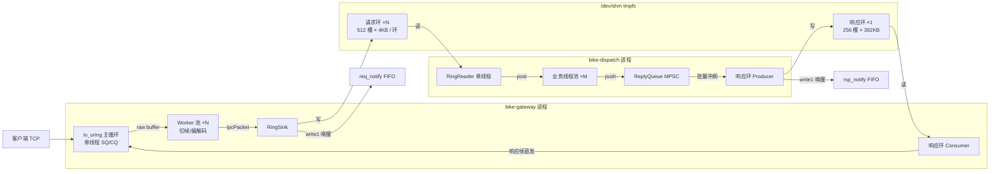
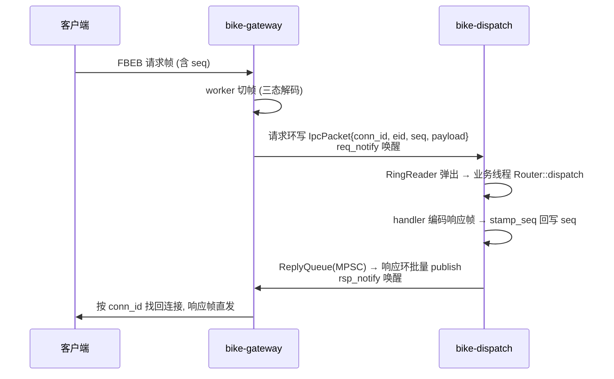
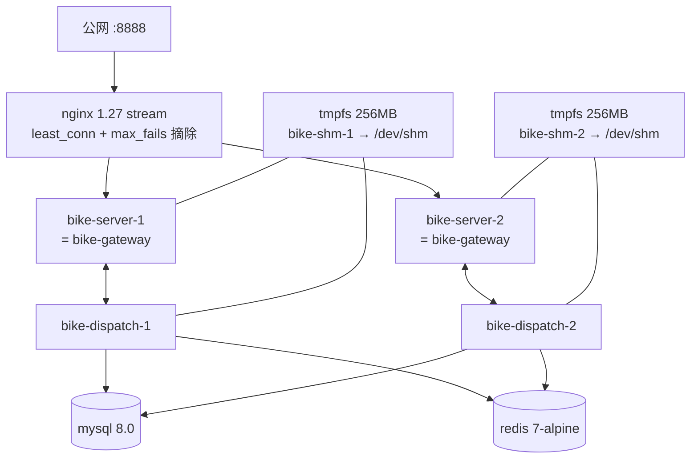

# 后端架构深度介绍

> 本文基于代码现状撰写；关键设计决策的完整论证见设计稿
> `docs/superpowers/specs/2026-08-08-gateway-io-uring-design.md`（网关）与
> `docs/superpowers/specs/2026-08-08-ipc-mmap-ring-design.md`（IPC 双进程）。

## 1. 总体形态：双二进制双进程

后端由两个 Linux-only 可执行文件构成，每实例一对进程：

| 进程 | 二进制 | 职责 | 不做什么 |
|---|---|---|---|
| **bike-gateway** | `server/src/gateway_main.cpp` | TCP 接入、粘包切帧、协议校验、连接生命周期、IPC 投递/回流 | ring 模式下不装配任何业务 Ctx/handler |
| **bike-dispatch** | `server/src/dispatch/dispatch_main.cpp` | Router 分发、全部 12 个 handler、MySQL/Redis、RideSessionStore | 不碰 socket |

两者经 `/dev/shm` 上的 **mmap SPSC 无锁环 + FIFO 通知** 连接。`[ipc].mode="inprocess"` 可回退单进程形态（进程内直连 Router，等价旧 `bike-server` 单体），用于单机调试与测试回归。



拆分收益：网关专注 IO 并发度（io_uring + 固定 worker），业务专注正确性与扩展性（可独立调 `dispatch_workers`）；故障域隔离，任一侧死亡由 compose 整套重拉（§8）。

## 2. 网关：io_uring Proactor 模型

核心实现 `server/src/gateway/uring_engine.cpp`（`UringEngine`）。

### 2.1 线程模型铁律（设计稿 §4）

1. **SQ 只在主循环线程操作**（`io_uring_get_sqe` / `io_uring_submit`）；
2. 主线程对 RECV 完成 **零解析**，raw buffer 整体移交 worker；
3. worker 完成后经 **WorkerOutbox（eventfd）** 交还主线程，由主线程补发 recv SQE / 排响应。

即：常驻线程 = 1（主循环）+ N（协议 worker，`[uring].workers`，与连接数无关）。worker 做纯 CPU 工作（三态切帧、payload 校验、IPC 投递），不做任何系统调用提交，避免 SQ 并发。

### 2.2 事件流

- 启动时提交四类常驻 op：`accept`（listen fd）、outbox eventfd read、stop eventfd read、rsp_notify FIFO read（ring 模式）。
- `io_uring_wait_cqe_timeout` 1s 超时兜底，驱动 `sweep_idle()` 与停机检查。
- RECV 完成 → 该连接的 rx buffer 交给某个 worker 做 **三态解码**（`decode_frame`：`NeedMore` / `BadFrame` / `Ok`，见 `common/include/bike/protocol.hpp`）：
  - `Ok`：整帧经 `PacketSink` 投递（ring 模式 → RingSink 写请求环；inprocess → 直连 Router）；
  - `BadFrame`：直接关连接（坏帧不自愈，客户端重连后重新对齐）；
  - `NeedMore`：保留残留字节，补发 recv。
- 响应回流（ring 模式）：主循环每轮 **无条件查响应环**（FIFO 通知只是提示），按 `conn_id` 找回连接直发客户端，网关对响应内容零解析。

### 2.3 连接生命周期与背压

- **空闲回收**：每轮循环检查连接空闲时长，超过 `[uring].idle_timeout_ms`（默认 60000ms）未收到任何字节的连接被主动断开。
- **发送背压**：单连接未发出字节超过 `send_backlog_limit_bytes`（默认 1MB）即关闭，防慢客户端拖垮内存。
- **请求环满（SinkOverload）**：ring 模式下请求环满时网关直接关闭该连接做背压；客户端表现为"网络异常"重连。频繁出现说明 Dispatch 消费跟不上，应调大 `[ipc].dispatch_workers` 或加实例。
- **优雅停机**：SIGTERM/SIGINT → 停止 accept，drain 在途请求（上限 5s），之后分批（每轮 ≤64）强制关闭残留连接并收割取消 CQE。

### 2.4 关键参数（`[uring]`，生产 `docker/server.toml`）

| 键 | 生产值 | 说明 |
|---|---|---|
| sq_depth / cq_depth | 256 / 512 | 提交/完成队列深度 |
| workers | 8（compose 用 `BIKE_GATEWAY_WORKERS=16` 覆盖） | 协议 worker 数 = 请求环个数 |
| rx_buf_bytes | 65536 | 每连接接收缓冲 |
| send_backlog_limit_bytes | 1048576 | 发送积压背压上限 |
| idle_timeout_ms | 60000 | 空闲连接回收 |
| accept_backlog | 1024 | listen backlog |

## 3. IPC：mmap SPSC 无锁环

头文件 `server/include/bike/ipc/`（纯逻辑、跨平台可单测），Linux 粘合层 `server/src/ipc/`（shm_open/mmap、FIFO）。设计稿 §4–§7。

### 3.1 共享内存布局（`shm_layout.hpp`）

每个 shm 文件 = `ShmFileHeader(128B)` + `RingHeader[ring_count]` + 页对齐的槽位区：

- **ShmFileHeader**：magic `"BIKE"` / version=1 / 环数 / 槽数 / 槽大小 / 文件全长 —— 打开方 attach 前完成全部校验（版本不符即重建）。
- **RingHeader(128B)**：producer 域（`head`、pid、心跳）与 consumer 域（`tail`、pid、心跳）**各占一条缓存行**，`static_assert` 固化 head/tail 不同行，消除伪共享。
- **槽位 = `IpcPacket(32B)` + 内联 payload**，定长、下标即偏移，无分配器无间接层；`IpcPacket` 携带 `conn_id / event_id / flags(kFlagOneWay) / seq / payload_len`，位置无关可整体 memcpy。

两类环（v1 槽数/槽大小为编译期常量，杜绝双进程不一致；toml 中的槽数配置仅做一致性校验）：

| 环 | 实例化 | 槽数 × 槽大小 | 单环体积 | 个数 |
|---|---|---|---|---|
| 请求环 `ReqRing` | `SpscRing<4096, 9>` | 512 × 4KB | 2MB | N = worker 数 |
| 响应环 `RspRing` | `SpscRing<401408, 8>` | 256 × 392KB | ≈98MB | 1 |

响应槽 392KB = 32B 报文头 + `kMaxMessageLen`(372680B) 协议上限，保证任意合法响应帧可内联。

### 3.2 SPSC 无锁协议（`spsc_ring.hpp`）

- Producer（head 唯一写者）：**两阶段批量写** —— `begin_write()` 预订槽并推进本地预订指针（不碰共享 head），连续填充后 `publish(n)` 一次性 release 发布；tail 用 acquire 读确认槽已归还。
- Consumer（tail 唯一写者）：`pop_batch()` 一次 acquire 读取可读批次（不跨数组回绕点，保证物理连续），消费完 `release(n)`。
- 32 位 head/tail 按模 2^32 做差值判定满/空；在途条目数 < 2^31（容量 ≤4096）恒正确。
- 唤醒：FIFO `write1()` 通知 + 读方先自旋 `spin_tries`（默认 64）再睡眠，延迟与 CPU 折中。

### 3.3 双向数据流



**seq 回带**：客户端每连接自增 seq，请求经 IpcPacket 透传到 Dispatch；Dispatch 在 handler 响应帧编码完成后用 `bike::stamp_seq()` 原位回写帧头 `[6,10)` 字节，业务 handler 代码（`bike_server_core`）零改动。

### 3.4 Dispatch 内部流水线（`dispatch_main.cpp`）

- **RingReader 单线程** 从 N 个请求环 `wait_pop`（有待冲刷响应时 poll 切片从 200ms 缩到 5ms，压低响应回流延迟），弹出后拷走 payload 投递 **M 个业务线程**（`[ipc].dispatch_workers`，生产 16）。
- 业务线程执行 `Router::dispatch`（eid → handler），单向事件（`kFlagOneWay`，即位置上报 0x15）不回响应。
- 响应经 **MPSC ReplyQueue** 汇聚，由 RingReader 批量冲刷进响应环（单写者语义）；环满时先发布已填部分再自旋等待，超过 `peer_timeout+1s` 丢弃尾部并走判活退出路径，不卡死。
- 每 30s 输出周期指标日志（累计消费数、ReplyQueue 峰值/现值、冲刷批次数）。

## 4. 协议：FBEB v2

### 4.1 帧格式（`common/include/bike/protocol.hpp`）

```
+4 bytes  magic       ASCII "FBEB"
+2 bytes  event_id    u16 little-endian
+4 bytes  seq         u32 little-endian (客户端每连接自增, 服务端原样回带)
+4 bytes  length      i32 little-endian (= N)
+N bytes  payload     serialized protobuf (proto/bike.proto)
```

帧头共 14 字节；payload 上限 `kMaxMessageLen = 372680`。提供兼容两态 `decode()` 与网关三态 `decode_frame()` 两个解码入口。

> v2 为破坏性变更（帧头由 10 字节升级为 14 字节新增 seq）：server / client / bench / 集成脚本必须原子协同发布；旧客户端连新服务端会因 magic/长度校验失败被快速断开。

### 4.2 事件表（23 个枚举常量，单一事实来源 = `bike::Event`）

请求为奇数，响应 = 请求 + 1（特例：`ListAccountRecords` 0x09 → 0x10）；`RidePositionReport`(0x15) 为单向事件无响应。

| Event ID | 方向 | 名称 | 说明 |
|---|---|---|---|
| 0x01 / 0x02 | req/rsp | mobile_code | 获取短信验证码 |
| 0x03 / 0x04 | req/rsp | login | 登录，返回 session token |
| 0x05 / 0x06 | req/rsp | recharge | 充值 |
| 0x07 / 0x08 | req/rsp | account_balance | 查询余额 |
| 0x09 / 0x10 | req/rsp | list_account_records | 账单流水列表 |
| 0x11 / 0x12 | req/rsp | list_nearby_bikes | 附近车辆（含动态投放） |
| 0x13 / 0x14 | req/rsp | scan_unlock | 扫码解锁，生成 ride_no |
| 0x15 | oneway | position_report | 骑行位置上报（无响应） |
| 0x17 / 0x18 | req/rsp | end_ride | 结束骑行并计费 |
| 0x19 / 0x1A | req/rsp | report_damage | 报修 |
| 0x1B / 0x1C | req/rsp | get_ride_detail | 订单详情（含轨迹点） |
| 0x1D / 0x1E | req/rsp | list_rides | 骑行历史 |

## 5. 业务能力（12 个 handler，`server/src/handlers/`）

| 业务 | 关键实现 |
|---|---|
| 登录/鉴权 | 验证码由 Redis 会话存储签发；`require_user(token)` 统一鉴权，token→uid 经 Redis |
| 余额/充值/账单 | `account` + `account_record` 表，金额全程 **分** 为单位的 int，无浮点 |
| 附近车辆 | 经纬度包围盒 SQL 查询 + haversine 圆形半径精过滤；**稀疏区域动态投放**：半径内车辆 < 5 时投放补齐到 12 辆，车号 `DY-` 前缀 + 6 位去混淆随机后缀（冲突重试 ≤4 次）；防抖策略保证每区域至多一波投放 |
| 扫码解锁 | `get_for_update` 行锁校验车辆状态（damaged/rented 拒绝）；余额 < 100 分拒绝；生成 `R+yyyyMMdd+seq` 订单号并在内存 `RideSessionStore` 建会话；车辆置 rented |
| 位置上报 | 单向事件，`RideSessionStore::update_pos` 按 seq 累积轨迹点（内存） |
| 结束计费 | 会话轨迹 = 起点 + 累积上报点 + 终点，按 elapsed 排序后 **逐段 haversine 累加里程**；`compute_fee` 计费（`common/include/bike/pricing.hpp`：起步 1 元含 15 分钟，之后每 15 分钟 0.5 元向上取整）；扣费、整条轨迹落 `ride` + `ride_position` 表、车辆更新位置并置 idle；订单已结时走幂等路径查历史返回 |
| 报修 | 车辆置 damaged |
| 历史/详情 | `list_rides` 分页列表；`get_ride_detail` 返回订单全字段 + 轨迹点序列供客户端回放 |

已知限制（与代码一致）：`scan_unlock` 的 ride_no 日序号暂用 `now_unix() % 999999` 占位（高并发可能撞号，生产规划换 Redis INCR）；`RideSessionStore` 在 Dispatch 进程内存中，整套重启会丢失活跃骑行会话（恢复流程见 ops.md）。

## 6. 数据库

MySQL 8.0，初始化脚本 `docker/mysql-init/`（按文件名字母序执行）：

| 表 | 用途 | 关键点 |
|---|---|---|
| `userinfo` | 用户 | `mobile` UNIQUE |
| `account` | 余额 | 单位：分 |
| `account_record` | 账单流水 | type/amount/balance_after，索引 `(user_id, tm)` |
| `bike` | 车辆 | `bike_no` UNIQUE；status 0=idle 1=rented 2=damaged；lat/lng decimal(10,7) |
| `ride` | 订单 | `ride_no` UNIQUE；起终点/时长/里程/金额；索引 `(user_id, start_tm)`、`(bike_id, start_tm)` |
| `ride_position` | 订单轨迹点 | `(ride_id, seq)` 索引；存完整骑行轨迹供回放 |

Redis 7：session token（登录态）与验证码的会话存储（`server/src/cache/redis_session_store.cpp`）。

数据访问：`server/src/db/` 下 MySQL 连接池（`[mysql].pool_size=8`）+ 四个 repo（user/account/bike/ride）；repo 接口与实现分离，handler 单测链接内存实现，生产由 `ctx_factory` 装配 MySQL/Redis 实现。

## 7. 部署拓扑

`docker/docker-compose.yml`（生产栈）：



要点：

- **每实例一对容器**：`bike-dispatch-N`（建环方，先启动）+ `bike-server-N`（纯网关，容器名历史沿用，nginx upstream 按此名引用），`BIKE_INSTANCE` 区分 shm/FIFO 命名，`BIKE_GATEWAY_WORKERS=16` 两侧一致。
- **tmpfs 共享卷**：每实例独享 256MB tmpfs 挂 `/dev/shm`，环文件 + FIFO 全落内存，容器重建即清空，与 `ShmRegion::create_or_recover` 的残留恢复语义自洽。
- **gateway 容器 `seccomp:unconfined`**：io_uring 系列 syscall 被 Docker 默认 seccomp 拦截（EPERM），必须放开。
- **依赖序**：mysql/redis healthy → dispatch healthy → gateway 启动 → nginx。
- 镜像构建：`docker/Dockerfile.server`（builder 阶段 apt 装 liburing/hiredis/mysql 开发包 + vcpkg protobuf）。

## 8. 判活与自愈

| 机制 | 实现 |
|---|---|
| 心跳 | 双方每 1s 写各自 RingHeader 的 heartbeat_ns（网关另有独立心跳线程刷全部请求环 producer） |
| 对端判死 | 任一侧检测到对端心跳超时（`[ipc].peer_timeout_ms` 默认 5s）→ **本进程主动退出**，由 compose `restart: unless-stopped` 重拉整套；不做运行时热重附着 |
| Dispatch healthcheck | 每 1s touch `/tmp/bike-dispatch{instance}.alive`；compose 检查为**存在性+新鲜度复合**（`find -mmin -0.1` ≈ 6s 内更新过），防进程卡死后文件残留误判健康 |
| Gateway 无 healthcheck | 存活性由 Dispatch 判活联动（对端死 → 自退重拉），且依赖 Dispatch 先 healthy |
| nginx 摘除 | upstream `max_fails=3 fail_timeout=5s`，停单实例时 least_conn 自动将流量切到另一实例 |
| shm 残留 | `create_or_recover`：Dispatch 启动时校验/重建环文件；tmpfs 卷容器重建自动清空，正常运维无需手动清理 |

窗口行为：判死重拉的短暂窗口内新连接会失败，客户端凭自身指数退避重连恢复（见 [client.md](client.md)）。

## 9. 配置速查（`docker/server.toml` 的 `[ipc]` 段）

| 键 | 默认 | 说明 |
|---|---|---|
| mode | ring | `ring`=双进程；`inprocess`=回退单进程（不需 bike-dispatch） |
| shm_root / shm_prefix | /dev/shm / bike | FIFO 目录与文件名前缀（`{prefix}{instance}_req` 等） |
| instance | 0 | 实例号；`BIKE_INSTANCE` 环境变量覆盖（双进程必须一致） |
| open_timeout_ms | 10000 | Gateway 等 Dispatch 建环上限，超时 fail-fast 重拉 |
| peer_timeout_ms | 5000 | 对端心跳超时 → 判死 → 本进程退出重拉 |
| spin_tries | 64 | 读方睡眠前自旋次数（延迟 vs CPU 折中） |
| dispatch_workers | 16 | Dispatch 业务线程数 M |
| req_ring_slots / rsp_ring_slots | 512 / 256 | 编译期常量约束：必须与 `ReqRing/RspRing::kSlotCount` 一致，否则 load_config 报错 |

> 更多运维细节（双进程重启顺序、shm 兜底清理、stuck 单车恢复 SQL）见 [ops.md](ops.md)。
