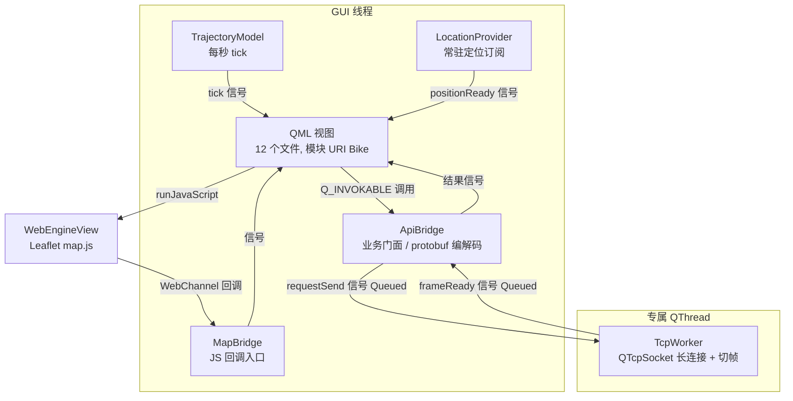
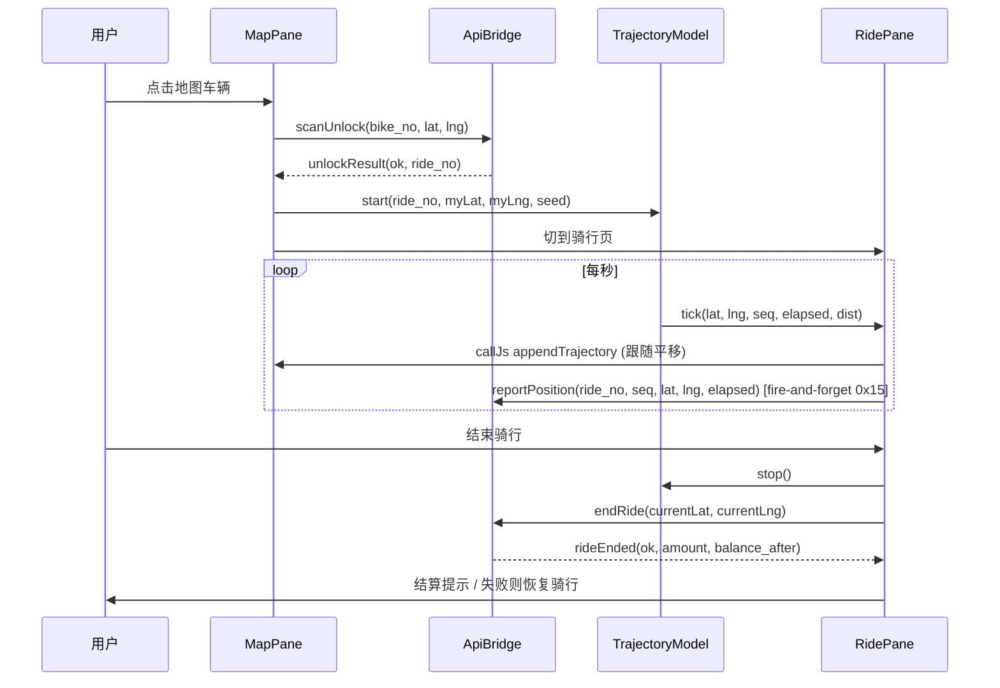

# 客户端架构深度介绍（Qt6 QML 桌面端）

客户端目标 `bike_client`，代码位于 `client/`。形态：**QML 视图（GUI 线程）** + **C++ 网络/定位/轨迹核心**（`bike_client_core` 静态库），通过 context property + 信号槽（自动 `QueuedConnection`，全程零锁）解耦。

## 1. 线程模型与组件总览

`client/src/main.cpp` 注册四个 context property 供 QML 使用：`api`（业务门面）、`mapBridge`（地图桥）、`trajectory`（轨迹模拟）、`location`（定位）。



**零锁约束**：不使用 `QMutex` / `QtConcurrent` / `std::thread` / atomic 于业务路径；所有跨线程交互走信号槽（跨线程自动 `QueuedConnection`），socket 读写只发生在 `TcpWorker` 所在线程。

## 2. 网络层

### 2.1 TcpWorker（`client/src/net/tcp_worker.hpp/.cpp`）

必须 `moveToThread` 到专属 `QThread` 使用（无 parent 构造）。职责：

- **长连接**：`connectToServer(host, port)` 建立 `QTcpSocket`；连接成功后冲刷断线期间缓存的待发帧（`pending_`，上限丢弃最旧）。
- **切帧**：`consume_frames()` 纯函数从接收缓冲消费尽可能多的完整 FBEB v2 帧；半包保留等下次投递；坏帧（magic/len 非法）返回 false → 调用方断连（**坏帧自愈**：断开后重连即重新对齐字节流）。抽成纯函数便于无 socket 单测覆盖粘包/半包/坏 magic。
- **指数退避重连**：断线后 500ms 起步、上限 10s 自动重连；`reconnect_scheduled_` 防止 error/disconnect 双路径重复排程；`shutdown()` 后停止。
- 信号：`connected` / `disconnected(reason)` / `frameReady(eid, seq, payload)` / `errorOccurred`。

### 2.2 ApiBridge（`client/src/net/api_bridge.hpp/.cpp`）

QML 侧唯一业务门面（context property `api`），驻 GUI 线程；protobuf 编解码微秒级，不另设线程。核心机制：

- **12 个异步入口**（`Q_INVOKABLE`，全部立即返回，结果经对应结果信号送达）：`sendMobileCode / login / recharge / refreshBalance / listRecords / refreshNearbyBikes / scanUnlock / reportPosition / endRide / reportDamage / rideDetail / listRides`，外加 `clearActiveRide()`（孤儿订单"忽略"语义）。
- **seq 管理**：`seq_counter_` 每连接自增、回绕跳过 0，随请求帧发出，服务端原样回带。
- **per-eid 单飞**：`in_flight_`（请求 eid → 在途 seq）；同请求 eid 在途时拒绝新请求（`beginRequest` 返回 false 并记日志），防重复提交。
- **断线在途失败广播**：`failInFlight()` 在断线/重连时对每个在途请求 eid emit 对应失败 Result 信号并清空，避免 QML 侧 pending 标志永久卡死。
- **会话状态**：`token_`（登录态）、`mobile_`、`active_ride_`（进行中订单，QSettings 持久化，供重启后孤儿订单恢复）。Q_PROPERTY：`loggedIn / token / mobile / activeRide / linkUp`（`linkUp` 驱动顶部"已连接/重连中"指示）。

## 3. QML 页面结构与导航

QML 模块 URI `Bike`（v1.0），12 个文件（`client/CMakeLists.txt` 的 `qt_add_qml_module`），其中 `Theme.qml` 为 `pragma Singleton`（须与生成的 qmldir 同目录，即 client 根目录）。

| 文件 | 角色 |
|---|---|
| `Main.qml` | 根窗口（1024×700）：`StackView` 在 `LoginView` ↔ `MainScreen` 间切换，监听 `api.sessionChanged`，带淡入淡出 Transition |
| `LoginView.qml` | 验证码登录页（手机号 → 获取验证码 → 登录） |
| `MainScreen.qml` | 主界面：顶部标识栏（logo + linkUp 指示灯 + 手机号）+ 线路式页签条 + `SwipeView` 五页 |
| `MapPane.qml` | 地图页（WebEngineView 承载 Leaflet） |
| `RidePane.qml` | 骑行中页（计时/里程/计费 HUD + 结束骑行） |
| `WalletPane.qml` | 钱包（余额 + 充值） |
| `RecordsPane.qml` | 账单流水 |
| `HistoryPane.qml` | 骑行历史列表 |
| `RideDetail.qml` | 订单详情 **Dialog 弹窗**：元信息 + 轨迹地图 + 回放（内嵌于 HistoryPane） |
| `Theme.qml` | 单例主题（配色 / 字体 / 金额与时长格式化 / 本地计费预览） |
| `BikeButton.qml` / `Field.qml` | 通用按钮 / 输入控件 |

导航语义：`MainScreen` 页签条五个页签（地图 / 骑行中 / 钱包 / 账单 / 历史）映射 `SwipeView`（`interactive:false`，仅页签切换）；**“骑行中”页签在无进行中订单时禁用**。订单详情为历史页内嵌的 `RideDetail` 弹窗（非页面跳转）。

## 4. 地图与定位

### 4.1 地图（WebEngine + Leaflet）

`MapPane.qml` 内 `WebEngineView` 加载 `qrc:/map.html`（`client/resources/`，map.html/map.js/map.css 内嵌打包），Leaflet + 高德瓦片。C++ ↔ JS 双向通道：

- **C++ → JS**：`mapPane.callJs(code)` → `runJavaScript`，调用 map.js 全局函数：
  `setUserLocation(lat,lng)` / `renderBikes(bikes)` / `appendTrajectory(lat,lng)`（内部 panTo，即骑行跟随）/ `clearTrajectory()` / `drawFullTrajectory(points)`。
- **JS → C++**：`QWebChannel` 暴露 `MapBridge`（context property `mapBridge`），map.js 经 `window.bridge.onBikeClicked(bike_no)`（地图点车触发扫码解锁）与 `onBikeCountsUpdated(idle, damaged)` 回调。

视角策略细节：常驻定位每 2–3 秒推送一次，`setUserLocation` **仅当定位越出当前视口才 panTo**，避免打断用户手动拖图；`renderBikes` 绘制后若视口内无任何车辆标记则 `fitBounds` 兜底防空地图。

### 4.2 定位（LocationProvider）

`client/src/location_provider.hpp/.cpp`，context property `location`：

- **常驻订阅模型**：构造时创建一次 `QGeoPositionInfoSource` 并 `startUpdates()`，2s 周期推送（旧实现是"每次新建 source 单次请求"，导致定位不实时）。
- **错误处理**：区分 `AccessDenied`（停止更新并暴露状态）与 `UpdateTimeout`（仅提示，保留周期更新）；首次定位超时约 8s 看护。
- **默认坐标**：无定位时兜底 `(39.9821, 116.3145)`（北京五道口）。QML 入口 `requestOnce()`：有缓存立即推送，同时强制请求新更新；结果经 `positionReady(lat, lng)` 信号送达。

## 5. 骑行与回放流程

### 5.1 骑行中（TrajectoryModel + RidePane）

`TrajectoryModel`（context property `trajectory`）是 `TrajectorySim` 的 QObject 包装：GUI 线程 `QTimer` 每秒 tick 推进一步模拟轨迹，emit `tick(lat, lng, seq, elapsedSec, distanceM)`。

完整骑行闭环（客户端侧）：



关键行为：
- 解锁成功即 `clearTrajectory()` 并以当前坐标 + 时间戳种子启动模拟；
- **位置上报 fire-and-forget**（单向 0x15），每秒一步，替代旧 detach 线程方案；
- 点"结束骑行"立即 `trajectory.stop()` 防等待响应期间继续刷 0x15 / 覆盖结算显示；
- 结束**失败**则以当前位置 + 新种子重启模拟并恢复计时（`start` 幂等）；
- 结束后 `MainScreen` 跳转账单页并弹结算对话框；
- **孤儿订单**：启动时若 `api.activeRide` 非空且模拟未运行，弹框提示"尝试结束"（兜底坐标）或"忽略并清除"（`clearActiveRide`）。

### 5.2 历史与轨迹回放

`HistoryPane` 打开时经 `api.listRides(50)` 拉取骑行历史；点入订单经 `api.rideDetail(ride_no)` 获取详情（服务端返回订单全字段 + 完整轨迹点序列，来源 `ride_position` 表），`RideDetail` 弹窗先 `drawFullTrajectory(points)` 整体绘制轨迹并 `fitBounds` 适配视角，再用 50ms/点的定时器逐点 `appendTrajectory` 做增量回放动画。

## 6. 构建与打包

### 6.1 CMake 目标（`client/CMakeLists.txt`）

- **`bike_client_core`**（STATIC）：网络层（tcp_worker/api_bridge）+ 轨迹模拟（trajectory_sim/trajectory_model）+ map_bridge，供应用与单测共用。本机缺 WebEngine 时该库仍可编译，保证语法级验证与单测可达。
- **`bike_client`**（qt_add_executable + qt_add_qml_module URI Bike）：依赖 Qt6 Core/Network/Quick/QuickControls2/**WebEngineQuick**/WebChannel/Positioning。缺任一 GUI 模块时优雅降级——跳过 `bike_client`，仅构建 core + 测试，并输出 WARNING。
- **测试**（GTest 存在时）：`client_trajectory`（轨迹模拟）、`client_tcp_worker`（网络层，依赖 Qt6::Test）；Windows 下 ctest 自动把 Qt 运行库目录注入 PATH。

### 6.2 Windows 配置与构建脚本

顶层 C++20，构建选项 `BIKE_BUILD_CLIENT=ON`。

- **`configure.bat`**：call vcvars64 → vcpkg 工具链（triplet `x64-windows`）+ Qt 6.10.1 msvc2022_64 + Ninja Release，`-DBIKE_BUILD_CLIENT=ON -DBIKE_BUILD_SERVER=OFF -DBIKE_BUILD_TESTS=OFF`，输出到 `build/`。前置：vcpkg 已装 protobuf、Qt 6.x 含 msvc2022_64 组件、VS2022+ C++ 桌面负载。
- **`build.bat`**：复用同一 VS 环境与 vcpkg 自带 cmake，`cmake --build build --target bike_client -j`；成功后对 `build\client\bike_client.exe` 执行 **`windeployqt --qmldir client`**，把 Qt/protobuf 运行库 DLL 与 QML 模块依赖（Bike/Quick/WebEngine 等）部署到 exe 旁，产出可直接分发的目录。

### 6.3 运行与服务器地址

```bat
set BIKE_SERVER_HOST=127.0.0.1 & set BIKE_SERVER_PORT=8888   :: 可选覆盖
build\client\bike_client.exe
```

默认连接现网云服务器 `124.220.92.243:8888`（`main.cpp` 硬编码默认值，环境变量覆盖）。

> 平台范围：当前仓库 `client/` 为 Windows 桌面全功能形态，未见 Android/移动端打包相关文件，故本文仅描述桌面端。
