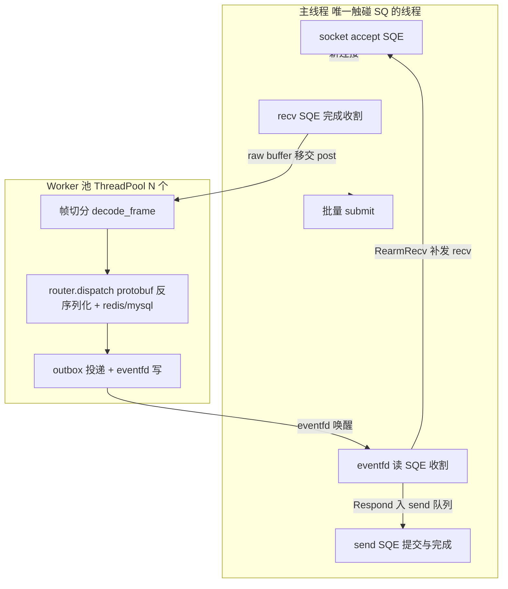

# Gateway io_uring 网关重构设计稿

- 日期: 2026-08-08
- 状态: 待评审(评审通过后进入编码)
- 范围: 模块二 —— 以 liburing/io_uring 整体替换 bike-server 网关侧 asio 事件循环
- 约束: 本稿只出设计, 不改任何现有代码

---

## 1. 背景与现状基线(已核实)

- C++20 单体 `bike-server`: 单 `asio::io_context` 多线程 `run`(线程数 = `server.threads`)
  + 独立业务线程池 `ThreadPool`(`server/include/server/util/thread_pool.hpp`, mutex+cv+队列)。
  同步 hiredis/mysql 调用丢给业务池(half-sync/half-async)。
- FBEB 线协议: `"FBEB"(4) + event_id u16 LE(2) + payload 长度 i32 LE(4) + protobuf payload`,
  `kHeaderLen=10`, `kMaxMessageLen=372680`(`common/include/bike/protocol.hpp` +
  `common/src/protocol.cpp` 的 `encode/decode`)。
- 事件号已收敛为 `enum class Event : std::uint16_t`(23 常量 + `bike::event_id()`),
  12 请求/11 响应, 响应 = 请求+1, 特例 `0x09→0x10`, `0x15` 位置上报单向无响应。
- asio 全部隔离在 `bike_server_net`(仅 `server.cpp` + `session.cpp`);
  帧解析内联在 `session.cpp`(`do_read_header/do_read_body`, 未复用 `common::decode`);
  唯一业务派发接缝是 `pool_.post([..]{ router_.dispatch(eid, payload, ctx); .. })`。
- `bike_server_core`(Router + 12 handlers + auth)不依赖 asio, 全部保留。
  **关键事实: handler 内部自行调用 `bike::encode(Frame)` 返回完整帧字节**
  (见 `server/src/handlers/login.cpp`), Router::dispatch 的返回值是已编码帧。
  这决定了 seq 回带采用"网关在帧头原位 stamp"方案, `bike_server_core` 零改动。
- 部署: Docker(`docker/Dockerfile.server` + `docker-compose.yml`, MySQL+Redis+nginx),
  监听 `:8888`, 目标 Ubuntu 云服务器。**本地开发机为 Windows, io_uring 代码本地不可编译**,
  验证策略见第 10 节。

---

## 2. 目标与非目标、验收指标

### 2.1 目标

1. 网关侧引入 `<liburing.h>`, **整体移除 asio**(网关侧事件循环、依赖、vendored 头文件)。
2. 主线程单线程持有 SQ: `io_uring_queue_init` + `io_uring_wait_cqe(_timeout)` 批量收割
   (`io_uring_for_each_cqe` + 一次性 `io_uring_cq_advance` + 批量 `io_uring_submit`)。
3. 每个连接建立 `Connection` 上下文, 通过 `sqe->user_data` 挂载类型化 Op 标记。
4. RECV 完成后主线程**零解析**(不读帧头、不碰 protobuf), 将 raw buffer 整体移交 Worker 池。
5. Worker 处理完毕后经 **eventfd** 通知主线程补发下一个 Recv SQE; SQ 提交永远只在主线程。
6. 帧头扩展 seq 字段(见第 3 节), 重构期直接切换, 不做新旧兼容。
7. 网关职责收敛为: 接入 + 帧编解码 + 解析派发; 为 Step 3(mmap SPSC 环 + 独立 Dispatch 进程)
   预留 `PacketSink` 可插拔接缝, Step 2 用进程内直连 Router 的 stub 实现, 可独立交付与回归。

### 2.2 非目标

- 不改 `bike_server_core`(Router/12 handlers/auth/ctx), 不改业务语义。
- 不改 MySQL/Redis 同步调用模型(dispatch 仍在 worker 线程同步阻塞)。
- 不实现 Step 3 的跨进程环(只留接缝)。
- 不改 Qt 客户端(客户端帧格式随动改造是独立后续任务, 见 3.5)。
- 不改 `proto/bike.proto`。
- 不追求极限吞吐: 当前瓶颈在 redis/mysql 而非网络层。

### 2.3 验收指标

既有 bench 基线: **19,925 QPS @ c500, P99 = 32.4ms**(瓶颈在 redis/mysql)。

| 指标 | 基线 | 验收线 | 说明 |
|---|---|---|---|
| QPS @ c500 | 19,925 | ≥ 19,000(不回退 >5%) | 瓶颈不在网络层, 不承诺提升 |
| P99 @ c500 | 32.4ms | ≤ 35ms | 同上 |
| 空闲并发连接 | 未测(旧模型线程/内存随连接增长) | **c5000 稳定、c10000 可用** | 本次收益主战场 |
| 常驻线程数 | io×N + biz×2N | 1(主) + workers(固定, 与连接数无关) | 结构性收益 |
| 回归 | — | ctest 全绿 + `docs/smoke_checklist.md` 全过 + seq 回带抽验 | — |

收益定位: 连接规模、单连接成本与尾延迟确定性, 而非 QPS 上限。

---

## 3. 新帧格式定义(含 seq)与 common 协议层改动

### 3.1 帧布局

```
offset  长度  字段      字节序  说明
─────────────────────────────────────────────────────────
0       4    magic     ASCII   "FBEB"
4       2    event_id  LE u16  事件号(bike::Event)
6       4    seq       LE u32  新增: 请求序号
10      4    len       LE i32  payload 字节数(0..kMaxMessageLen)
14      len  payload   bytes   protobuf 序列化体
```

- `bike::kHeaderLen` 由 10 改为 **14**; `kMaxMessageLen=372680` 不变(payload 上限, 与头无关)。
- 字节序: 全字段小端, 与现行 eid/len 一致; x86/ARM 客户端(含 Qt 客户端)均为 LE 平台,
  直接 memcpy 语义, 无对齐问题(u16/u32 按字节拆装, 沿用现有 put/get 风格)。

### 3.2 seq 语义(拍板结论)

- **客户端**: 每连接独立自增计数器, 从 1 开始, 每发一帧 +1, `0xFFFFFFFF` 后回绕到 1。
  seq 只在本连接内有意义, 用于客户端将响应与并发发出的请求配对(为未来单连接多路复用铺路)。
- **服务端**: **仅回带, 不配对**。收到请求帧后, 把该帧 seq 原样写入响应帧头; 不维护
  (conn, seq) 配对表。理由:
  1. 配对状态天然属于客户端(谁并发发出谁配对);
  2. 服务端配对表每连接都有状态成本, 且 worker 并行下响应本就可能乱序, 配对表无约束力;
  3. 服务端对 seq 无状态 ⇒ 重复/乱序 seq 不影响正确性, 无需校验, 攻击面为零。
- **单向事件**(`0x15` 位置上报): 无响应, seq 被服务端直接丢弃。
- 响应帧的 event_id 仍由 handler 决定(`响应=请求+1, 0x09→0x10` 规则不变)。

### 3.3 common 协议层改动点(`common/include/bike/protocol.hpp` + `common/src/protocol.cpp`)

```cpp
// ---- bike/protocol.hpp 目标形态(完整) ----
#pragma once

#include <cstdint>
#include <optional>
#include <string>
#include <vector>

namespace bike {

inline constexpr char kFrameMagic[4] = {'F', 'B', 'E', 'B'};
inline constexpr std::uint32_t kHeaderLen = 14;   // 10 -> 14 (+seq u32 LE)
inline constexpr std::uint32_t kMaxMessageLen = 372680;

enum class Event : std::uint16_t { /* 23 个常量, 保持现状不变 */ };

inline constexpr std::uint16_t event_id(Event e) {
    return static_cast<std::uint16_t>(e);
}

struct Frame {
    std::uint16_t event_id{0};
    std::uint32_t seq{0};      // 新增。放在 payload 之前不影响现有
                               // {.event_id=.., .payload=..} 指定初始化语法
    std::string payload;
};

std::vector<std::uint8_t> encode(const Frame& f);

struct DecodeResult {
    Frame frame;
    std::size_t consumed{0};
};
// 兼容入口: 半包/坏帧统一返回 nullopt(现有 client/tests 语义不变)
std::optional<DecodeResult> decode(const std::uint8_t* buf, std::size_t n);

// 新增: 区分半包与坏帧(magic 错/len 越界), 网关 worker 切帧依赖此区分
enum class DecodeStatus : std::uint8_t { NeedMore, BadFrame, Ok };
struct DecodeOutcome {
    DecodeStatus status{DecodeStatus::NeedMore};
    Frame frame;
    std::size_t consumed{0};
};
DecodeOutcome decode_frame(const std::uint8_t* buf, std::size_t n);

// 新增: 对 encode() 产物原位回写 seq 字段(字节偏移 [6,10))。
// 供网关把请求 seq stamp 进 handler 已编码的响应帧, 使 bike_server_core 零改动。
// magic 不符或长度不足返回 false。
bool stamp_seq(std::vector<std::uint8_t>& encoded, std::uint32_t seq);

} // namespace bike
```

`protocol.cpp` 对应改动: `encode` 在 eid 后写 `put_u32_le(seq)` 再写 len;
`decode_frame` 按新偏移解析(magic@0, eid@4, seq@6, len@10);
`decode` 实现为 `decode_frame` 的薄包装(非 Ok 一律 nullopt);
`stamp_seq` 为 4 字节原位覆写。

**函数签名影响面**: `encode/decode` 签名本身不变, 只有 `Frame` 多一个默认初始化的 seq 字段,
现有所有调用点(handler 的指定初始化、client、tests)可编译; 语义上所有现存测试的期望字节
序列变化(头长 10→14), 必须同步更新(见 3.4)。

### 3.4 测试影响

- `common/tests/test_protocol.cpp`: 全部用例按 14 字节头重排期望值;
  新增: seq 回环(encode 带 seq → decode 还原)、`decode_frame` 三态
  (NeedMore/BadFrame/Ok)、`stamp_seq` 正确性与失败路径。
- `server/tests/test_handlers*.cpp`: 不受影响(只比较解码后 payload/业务结果;
  若存在对帧字节的硬编码期望, 随 14 字节头更新)。

### 3.5 兼容策略(建议: 直接切换, 不兼容)

重构期**直接切换新帧, 不提供 10 字节旧帧兼容**。理由:

1. 客户端(Qt)与服务端同团队同步发布, 无第三方接入方;
2. 双格式探测(magic 后按长度歧义区分)会把歧义永久留在协议里, 成本高于收益;
3. 旧客户端连新服务端会因头解析失败被快速断开, 行为可预期(不会误帧)。

代价与前置条件: Qt 客户端 `client/src/backend_client.cpp` 的帧编解码必须随本次同步改造
(独立任务, 列为本设计发布的前置/伴随任务)。

---

## 4. 线程模型与事件流

### 4.1 线程模型图



铁律:

- **SQ 只在主线程操作**(`io_uring_get_sqe` / `io_uring_submit`); worker 永远不碰 ring。
- **主线程零解析**: RECV cqe 到达后只做 memcpy 累积 + 移交, 不检查 magic、不读帧头。
- worker → 主线程的唯一通道: `WorkerOutbox`(mutex+deque)+ eventfd。

### 4.2 eventfd rearm 流程时序

```
主线程                          Worker                     内核
  │  submit recv(conn)           │                          │
  │──────────────────────────────────────────────────────►  │ 数据到达
  │  ◄────────────────────── RECV cqe (res>0) ──────────────│
  │  rx.feed(bytes)              │                          │
  │  conn.state = Parsing        │                          │
  │  pool.post(conn_id, raw)     │                          │
  │──────────────────────────►   │                          │
  │  (不再为该连接提交 recv)      │ decode_frame 循环切帧     │
  │                              │ 逐帧 router.dispatch      │
  │                              │ stamp_seq(reply, seq)    │
  │                              │ outbox.push(Respond)×k   │
  │                              │ outbox.push(RearmRecv,   │
  │                              │          leftover)       │
  │  ◄──────────── eventfd write │                          │
  │  eventfd cqe 到达            │                          │
  │  drain outbox:               │                          │
  │    Respond → push_send +     │                          │
  │              submit send     │                          │
  │    RearmRecv → 回填 leftover, │                          │
  │              state=Active,   │                          │
  │              submit recv     │                          │
  │  重新武装 eventfd 读 SQE      │                          │
```

要点:

- 一次移交 = 该连接当前累积的全部 raw 字节; Parsing 期间无 recv 在途 ⇒ 每连接任意时刻
  至多一个 worker 批次, 无并发写同一连接。
- leftover(半包尾巴)随 RearmRecv 回传主线程, 回填进 rx 累积区, 与下一次 recv 数据拼接。
- `Respond` 与 `RearmRecv` 是独立 item: 单向事件帧只产生 RearmRecv; 响应帧不依赖 rearm,
  send 路径与 recv 路径互不阻塞。

---

## 5. 核心头文件定义(完整可评审)

目录: `server/include/server/gateway/`(新增)。命名空间 `bike::gateway`。

### 5.1 user_data 类型标记: `uring_op.hpp`

区分 accept/recv/send/eventfd/stop 五类在途操作: `user_data` 挂指向 `UringOp` 的指针,
`kind` 判别类型。Op 对象由主线程 new/delete, 生命周期 = 在途 SQE。

```cpp
// server/include/server/gateway/uring_op.hpp
#pragma once

#include <cstdint>

namespace bike::gateway {

class Connection;

// 每个在途 SQE 对应一个 UringOp, 地址写入 sqe->user_data。
// 主线程独占创建/销毁; CQE 到达后按 kind 分发。
enum class OpKind : std::uint8_t {
    Accept,   // IORING_OP_ACCEPT, conn == nullptr
    Recv,     // IORING_OP_RECV,   conn != nullptr
    Send,     // IORING_OP_SEND,   conn != nullptr
    Wakeup,   // IORING_OP_READ on eventfd(worker→主线程通道), conn == nullptr
    Stop,     // IORING_OP_READ on stop_eventfd(信号→主线程), conn == nullptr
};

struct UringOp {
    OpKind kind{};
    Connection* conn{nullptr};
    // Wakeup/Stop: eventfd 读值槽位(8 字节), read SQE 的 buffer 指向它
    std::uint64_t event_val{0};
};

} // namespace bike::gateway
```

### 5.2 连接上下文: `conn_context.hpp`

```cpp
// server/include/server/gateway/conn_context.hpp
#pragma once

#include <chrono>
#include <cstdint>
#include <deque>
#include <span>
#include <vector>

namespace bike::gateway {

enum class ConnState : std::uint8_t {
    Active,    // 有 recv 在途, 可接收新数据
    Parsing,   // raw buffer 已移交 worker, 暂停 recv, 等 RearmRecv
    Closing,   // 已发起关闭, 等在途 op 归零后释放
};

// 每连接上下文。除标注外, 所有成员只允许主线程访问。
class Connection {
public:
    Connection(int fd, std::uint64_t conn_id, std::size_t rx_buf_bytes)
        : fd_(fd), conn_id_(conn_id) { pending_.reserve(rx_buf_bytes); }

    int fd() const noexcept { return fd_; }
    std::uint64_t conn_id() const noexcept { return conn_id_; }

    // ---- rx 累积区(主线程独占) ----
    // recv SQE 直接写入此空闲区; commit 后数据成为待移交 raw
    std::span<std::uint8_t> rx_writable() {
        return {pending_.data() + pending_.size(),
                pending_.capacity() - pending_.size()};
    }
    void rx_commit(std::size_t n) { pending_.resize(pending_.size() + n); }
    // 移交: 零拷贝 swap 出全部累积字节, 累积区重置(重新 reserve)
    std::vector<std::uint8_t> rx_take(std::size_t reserve_cap) {
        std::vector<std::uint8_t> out;
        out.swap(pending_);
        pending_.reserve(reserve_cap);
        return out;
    }
    // RearmRecv 时回填 worker 交还的半包尾巴
    void rx_feed(std::vector<std::uint8_t> leftover) {
        pending_.insert(pending_.end(), leftover.begin(), leftover.end());
    }
    bool rx_has_data() const noexcept { return !pending_.empty(); }

    // ---- send 队列(主线程独占) ----
    void send_push(std::vector<std::uint8_t> bytes) {
        send_bytes_ += bytes.size();
        send_q_.push_back(std::move(bytes));
    }
    bool send_pending() const noexcept { return !send_q_.empty(); }
    std::span<const std::uint8_t> send_front() const {
        return {send_q_.front().data(), send_q_.front().size()};
    }
    // 部分写: 剥掉已发出的 n 字节, 头块未发完则原地裁剪续写
    void send_pop(std::size_t n) {
        while (n > 0 && !send_q_.empty()) {
            auto& head = send_q_.front();
            if (n < head.size()) {
                head.erase(head.begin(), head.begin() + n);
                send_bytes_ -= n;
                return;
            }
            n -= head.size();
            send_bytes_ -= head.size();
            send_q_.pop_front();
        }
    }
    std::size_t send_backlog_bytes() const noexcept { return send_bytes_; }
    bool send_active() const noexcept { return send_active_; }
    void set_send_active(bool v) noexcept { send_active_ = v; }

    ConnState state{ConnState::Active};
    int pending_ops{0};   // 在途 op 计数(recv/send), Closing 归零后释放
    std::chrono::steady_clock::time_point last_active{};

private:
    int fd_{-1};
    std::uint64_t conn_id_{0};
    std::vector<std::uint8_t> pending_;              // rx 累积区
    std::deque<std::vector<std::uint8_t>> send_q_;   // 发送队列
    std::size_t send_bytes_{0};
    bool send_active_{false};
};

} // namespace bike::gateway
```

### 5.3 Worker→主线程通道: `worker_outbox.hpp`

MPSC 队列 + eventfd。队列的互斥/存取逻辑(`OutboxQueue`)是纯逻辑, 抽到
`bike_gateway_core` 便于 Windows 单测; eventfd 粘合在 Linux 侧。

```cpp
// server/include/server/gateway/worker_outbox.hpp
#pragma once

#include <cstdint>
#include <deque>
#include <mutex>
#include <vector>

namespace bike::gateway {

// worker 交还主线程的三种意图
enum class OutboxKind : std::uint8_t {
    Respond,    // bytes = 已编码(已 stamp seq)响应帧, 入 send 队列
    RearmRecv,  // leftover = 未切完的半包尾巴, 回填 rx 后补发 recv SQE
    Close,      // 坏帧/解析失败, 关闭连接
};

struct OutboxItem {
    OutboxKind kind{};
    std::uint64_t conn_id{0};
    std::vector<std::uint8_t> bytes;
};

// 纯逻辑 MPSC 队列(无系统调用, 跨平台可测)
class OutboxQueue {
public:
    void push(OutboxItem item) {
        std::lock_guard<std::mutex> lk(mu_);
        q_.push_back(std::move(item));
    }
    // 消费者一次性取空; 返回取到的数量
    std::size_t drain(std::vector<OutboxItem>& out) {
        std::lock_guard<std::mutex> lk(mu_);
        std::size_t n = q_.size();
        out.insert(out.end(),
                   std::make_move_iterator(q_.begin()),
                   std::make_move_iterator(q_.end()));
        q_.clear();
        return n;
    }
private:
    std::mutex mu_;
    std::deque<OutboxItem> q_;
};

// Linux 粘合: OutboxQueue + eventfd。push 时写 eventfd 唤醒主线程。
class WorkerOutbox {
public:
    WorkerOutbox();   // eventfd(0, EFD_CLOEXEC); 失败抛 std::runtime_error
    ~WorkerOutbox();
    int fd() const noexcept { return efd_; }

    void push(OutboxItem item);                     // worker 线程调用
    std::size_t drain(std::vector<OutboxItem>& out) // 仅主线程调用
        { return q_.drain(out); }

private:
    OutboxQueue q_;
    int efd_{-1};
};

} // namespace bike::gateway
```

### 5.4 业务接缝: `packet_sink.hpp`(Step 3 可插拔点)

```cpp
// server/include/server/gateway/packet_sink.hpp
#pragma once

#include <cstdint>
#include <string>
#include <vector>

#include "server/router.hpp"

namespace bike::gateway {

// 网关唯一的业务出口。网关只做接入/帧编解码/解析派发, 业务逻辑不下沉。
// Step 2: InProcessRouterSink —— 进程内直连 Router, 可独立交付与回归。
// Step 3: RingDispatchSink —— 把请求帧写入 mmap SPSC 环, 由独立 Dispatch 进程消费;
//         响应经环回流后再走 WorkerOutbox::Respond。接口不变, 只换实现。
class PacketSink {
public:
    struct Request {
        std::uint64_t conn_id{0};
        std::uint16_t event_id{0};
        std::uint32_t seq{0};
        std::string payload;   // 原始 protobuf 字节
    };

    virtual ~PacketSink() = default;

    // 同步处理并返回完整响应帧(handler 已 encode, seq 由调用方 stamp)。
    // 返回空 = 无响应(单向事件 0x15 / 未注册 eid)。在 worker 线程执行。
    virtual std::vector<std::uint8_t> handle(const Request& req,
                                             bike::server::Ctx& ctx) = 0;
};

// Step 2 stub: 直连 Router。注意 dispatch 返回的是 handler 已编码的完整帧。
class InProcessRouterSink final : public PacketSink {
public:
    explicit InProcessRouterSink(bike::server::Router& router)
        : router_(router) {}

    std::vector<std::uint8_t> handle(const Request& req,
                                     bike::server::Ctx& ctx) override {
        return router_.dispatch(req.event_id, req.payload, ctx);
    }

private:
    bike::server::Router& router_;
};

} // namespace bike::gateway
```

### 5.5 网关引擎: `uring_engine.hpp`

```cpp
// server/include/server/gateway/uring_engine.hpp
#pragma once

#include <atomic>
#include <chrono>
#include <cstdint>
#include <memory>
#include <string>
#include <unordered_map>

#include <liburing.h>

#include "server/router.hpp"
#include "server/util/thread_pool.hpp"
#include "server/gateway/conn_context.hpp"
#include "server/gateway/packet_sink.hpp"
#include "server/gateway/uring_op.hpp"
#include "server/gateway/worker_outbox.hpp"

namespace bike::gateway {

struct GatewayOptions {
    std::string listen{"0.0.0.0"};
    int port{8888};
    int sq_depth{256};                        // [uring] sq_depth
    int cq_depth{512};                        // [uring] cq_depth
    int workers{8};                           // [uring] workers
    std::size_t rx_buf_bytes{65536};          // 单连接 recv 累积上限
    std::size_t send_backlog_limit{1 << 20};  // 单连接发送背压上限(1MB)
    std::chrono::milliseconds idle_timeout{60000};
    int accept_backlog{1024};
};

// 单主线程 io_uring 引擎。约束:
//   - io_uring_get_sqe / io_uring_submit 只发生在 run() 所在线程;
//   - worker 线程只通过 WorkerOutbox 与主线程通信;
//   - Connection 及其 rx/send 缓冲只由主线程读写。
class UringEngine {
public:
    UringEngine(GatewayOptions opt,
                bike::server::Router& router,
                bike::server::Ctx& ctx,
                std::unique_ptr<PacketSink> sink);  // 可插拔, Step2 传 InProcessRouterSink
    ~UringEngine();

    UringEngine(const UringEngine&) = delete;
    UringEngine& operator=(const UringEngine&) = delete;

    // 阻塞当前线程运行事件循环, 直到 stop_requested() 且 drain 完成。
    // 内部: 建 listen socket / io_uring_queue_init / 启动 worker 池。
    void run();

    // 信号处理中调用(只置原子标志; 主线程每轮收割后检查)。
    void request_stop() noexcept { stopping_.store(true, std::memory_order_relaxed); }

private:
    // ---- 主循环 ----
    void harvest();                    // io_uring_wait_cqe_timeout + for_each_cqe 批量收割
    void on_cqe(struct io_uring_cqe& cqe);
    void complete_accept(UringOp& op, int res);
    void complete_recv(UringOp& op, int res);
    void complete_send(UringOp& op, int res);
    void drain_outbox();               // eventfd cqe 到达后处理 worker 交还项
    void sweep_idle();                 // 空闲超时清理(每轮收割后)

    // ---- SQ 提交(仅主线程) ----
    struct io_uring_sqe* get_sqe();    // SQ 满时先 submit 重试, 再满则 fatal
    void submit_accept();
    void submit_recv(Connection& conn);
    void submit_send(Connection& conn);
    void submit_eventfd_read();        // 重新武装 Wakeup op
    void submit_stop_probe();          // 周期性短轮询 stopping_(见 6.5 说明)

    // ---- 连接管理 ----
    Connection& make_conn(int fd);
    void close_conn(Connection& conn, const char* reason); // 置 Closing + 取消在途 op
    void finalize_conn(Connection& conn);                  // pending_ops==0 时 close(fd)+erase

    // ---- worker 侧 ----
    void worker_batch(std::uint64_t conn_id, std::vector<std::uint8_t> raw);

    GatewayOptions opt_;
    bike::server::Router& router_;
    bike::server::Ctx& ctx_;
    std::unique_ptr<PacketSink> sink_;

    struct io_uring ring_{};
    int listen_fd_{-1};
    bike::server::ThreadPool workers_{0};   // 构造时按 opt_.workers 建
    WorkerOutbox outbox_;
    std::atomic<bool> stopping_{false};

    std::uint64_t next_conn_id_{1};
    std::unordered_map<std::uint64_t, std::unique_ptr<Connection>> conns_;
    bool accepting_{true};
};

} // namespace bike::gateway
```

### 5.6 Worker 池

直接复用现有 `bike::server::ThreadPool`(`server/include/server/util/thread_pool.hpp`,
header-only, 无 asio 依赖)。引擎构造 `ThreadPool(opt.workers)`;
`complete_recv` 移交批次:

```cpp
workers_.post([this, conn_id, raw = std::move(raw)]() mutable {
    worker_batch(conn_id, std::move(raw));
});
```

`worker_batch` 逻辑(完整伪代码, 实现于 `uring_engine.cpp`):

```cpp
void UringEngine::worker_batch(std::uint64_t conn_id,
                               std::vector<std::uint8_t> raw) {
    const std::uint8_t* p = raw.data();
    std::size_t n = raw.size();
    bool bad = false;
    while (n > 0) {
        auto out = bike::decode_frame(p, n);
        if (out.status == bike::DecodeStatus::NeedMore) break;  // 半包尾巴
        if (out.status == bike::DecodeStatus::BadFrame) { bad = true; break; }
        PacketSink::Request req{conn_id, out.frame.event_id, out.frame.seq,
                                std::move(out.frame.payload)};
        std::vector<std::uint8_t> reply;
        try {
            reply = sink_->handle(req, ctx_);   // protobuf 反序列化 + redis/mysql
        } catch (const std::exception& e) {
            BIKE_LOG_ERROR("dispatch eid={} threw: {}", req.event_id, e.what());
        }
        if (!reply.empty()) {
            bike::stamp_seq(reply, out.frame.seq);   // 回带请求 seq
            outbox_.push({OutboxKind::Respond, conn_id, std::move(reply)});
        }
        p += out.consumed;
        n -= out.consumed;
    }
    if (bad) {
        outbox_.push({OutboxKind::Close, conn_id, {}});
        return;   // 不回 rearm, 主线程将关闭连接
    }
    outbox_.push({OutboxKind::RearmRecv, conn_id,
                  std::vector<std::uint8_t>(p, p + n)});  // leftover 半包
}
```

---

## 6. 粘包/半包与写路径设计

### 6.1 读路径(粘包/半包)

1. `submit_recv`: SQE buffer = `conn.rx_writable()`(累积 vector 尾部空闲区),
   `io_uring_prep_recv`。
2. RECV cqe(res>0): `rx_commit(res)` → `rx_take()` 零拷贝 swap 出全部累积字节 →
   `conn.state = Parsing` → `workers_.post(worker_batch)`。
   **主线程不检查任何帧头**; 即使只收到半个帧头也照样移交(该批次切不出帧,
   worker 只回带 RearmRecv + 全量 leftover)。
3. worker `decode_frame` 循环切帧: Ok→处理; NeedMore→剩余字节作为 leftover
   随 RearmRecv 回传; BadFrame→Close。
4. 主线程 `drain_outbox` 收到 RearmRecv: `rx_feed(leftover)` → `state=Active` →
   `submit_recv`。leftover + 新数据天然拼接, 半包闭环。
5. 粘包: 一次 recv 携带多帧 ⇒ worker 循环切帧全部处理, 多个 Respond + 一个 RearmRecv。
6. 超大帧防御: `len > kMaxMessageLen` 由 `decode_frame` 判 BadFrame 关连接;
   rx 累积区上限 `rx_buf_bytes`(默认 64KB > 常见帧; 若单帧 payload 逼近 372680,
   配置上调即可; 累积区满且无完整帧 ⇒ 视同 BadFrame 关连接, 防内存放大)。

### 6.2 写路径

1. Respond item → `conn.send_push(bytes)`; 若 `!send_active()` 则 `submit_send`。
2. `submit_send`: 取 `send_front()` 一块, `io_uring_prep_send(fd, ptr, len, MSG_NOSIGNAL)`,
   `send_active = true`, 挂 `UringOp{Send, &conn}`。
3. SEND cqe:
   - res == 头块长度: `send_pop(res)`; 队列非空 ⇒ 续写(再 submit_send),
     否则 `send_active = false`。
   - 0 < res < 头块长度(部分写): `send_pop(res)` 原地裁剪, 无条件续写。
   - res < 0(EPIPE/ECONNRESET 等): `close_conn`。
   - `MSG_NOSIGNAL` 保证写已关闭连接不产生 SIGPIPE。
4. 每连接任意时刻至多一个在途 SEND SQE(串行排队), 避免乱序发送;
   吞吐不足时后续可放宽为多 SQE 流水(开放问题)。

### 6.3 背压

- `send_backlog_bytes() > send_backlog_limit`(默认 1MB) ⇒ 判定客户端不消费,
  `close_conn("send backlog overflow")`。检查点: `drain_outbox` 入队时。
- 关闭后不再 rearm recv, 也不再受理该连接的 Respond(conn_id 查表落空即丢弃)。

---

## 7. 连接生命周期与错误处理

### 7.1 状态机

```
            accept 成功
   (不存在) ────────────► Active ◄──── RearmRecv(回填 leftover)
                            │  │
                    RECV cqe│  │ SEND 队列非空
                            ▼  ▼
                        Parsing / (send 独立并行)
                            │
                    BadFrame│ backlog 超限 / EOF / 错误 / idle
                            ▼
                         Closing ── 取消在途 op, pending_ops 归零
                            │
                            ▼
                        (close fd, erase, 释放 UringOp)
```

### 7.2 各 cqe 结果处理

| 场景 | 处理 |
|---|---|
| ACCEPT res<0 | EMFILE/ENFILE 等: 记日志, 延时重挂 accept; 其余 fatal 视情况 |
| ACCEPT res≥0 | 建 Connection(设 TCP_NODELAY), `submit_recv`, 重挂 accept |
| RECV res==0 | EOF, `close_conn("peer closed")` |
| RECV res<0 | `close_conn(strerror(-res))` |
| SEND res<0 | `close_conn` |
| 连接已 Closing 时到达的 cqe | 不再补 SQE, `--pending_ops`, 归零 `finalize_conn` |

### 7.3 关闭的正确次序(防 use-after-free)

`close_conn` 不立即释放 Connection: 置 `Closing`, 对每个在途 op 提交
`IORING_OP_ASYNC_CANCEL`(按 user_data 定向取消); 被取消 op 与取消 op 自身的 cqe
都只递减 `pending_ops`; 归零后 `close(fd)` + 从 `conns_` 移除 + delete Connection。
绝不先 close(fd) 再等在途 SQE(fd 复用竞态)。

### 7.4 超时

- 空闲超时: 主循环每轮(≤1s, 由 `io_uring_wait_cqe_timeout` 的 ts={1,0} 驱动)
  `sweep_idle()`: `now - last_active > idle_timeout` ⇒ `close_conn("idle")`。
  `last_active` 在 RECV/SEND cqe 与 RearmRecv 时刷新。
- 不采用 `IORING_OP_LINK_TIMEOUT`(与 rearm 解耦模型冲突);
  per-conn 定时器轮为后续优化(开放问题)。

### 7.5 优雅停机(SIGTERM/SIGINT)

1. 信号处理: `sigaction` 处理 SIGTERM/SIGINT → 置 `stopping_=true`
   (async-signal-safe, 只做原子 store; 主循环每轮收割后检查标志,
   另以 1s 超时唤醒兜底, 无需在信号里写 eventfd)。
2. `stopping_` 置位后: 停止重挂 accept, `close(listen_fd)`(新连接拒绝);
3. 等存量: 给 drain 设 5s deadline —— 等所有 Parsing 批次的 RearmRecv/Respond 回来、
   send 队列排空; 超时则强制 close 剩余连接;
4. `ThreadPool` 析构语义(join, 队列排空)保证 worker 无在途;
5. 关闭所有连接 fd → `io_uring_queue_exit` → `run()` 返回 → 进程退出码 0。

---

## 8. 替换方案清单

### 8.1 删除

> **勘误(2026-08-08 落盘实施)**: Qt 客户端实际使用 asio
> (`client/src/backend_client.cpp` 基于 asio 同步 socket), 下表中标注删除的
> vendored asio fallback 块、`third_party/asio/` 与 `vcpkg.json` 中 `asio` 条目
> **均保留**, 仅服务端网关移除 asio 依赖。以下三行不再执行:

| 文件 | 说明 |
|---|---|
| `server/src/server.cpp`, `server/include/server/server.hpp` | asio acceptor 封装 |
| `server/src/session.cpp`, `server/include/server/session.hpp` | asio 会话(内联帧解析) |
| `bike_server_net` 目标 | CMake 中整块移除 |
| ~~根 `CMakeLists.txt` 中 vendored asio fallback 块(`bike_asio_iface`)~~ | 保留(客户端仍用 asio) |
| ~~`third_party/asio/`(建议同批删除)~~ | 保留(客户端仍用 asio) |
| ~~`vcpkg.json` 中 `"asio"` 依赖~~ | 保留(客户端仍用 asio) |

### 8.2 新增

```
server/include/server/gateway/
    uring_op.hpp        # 5.1
    conn_context.hpp    # 5.2
    worker_outbox.hpp   # 5.3
    packet_sink.hpp     # 5.4
    uring_engine.hpp    # 5.5
server/src/gateway/
    outbox_queue.cpp    # OutboxQueue 非内联部分(如需) + WorkerOutbox eventfd 粘合(Linux)
    uring_engine.cpp    # 引擎实现
    rx_stream.cpp       # 若 5.6 切帧逻辑需要独立 TU(当前直接复用 bike::decode_frame, 可省)
server/tests/
    test_rx_cut.cpp     # decode_frame 三态 + 粘包/半包切帧循环(纯逻辑, Windows 可跑)
    test_outbox_queue.cpp
    test_router_sink.cpp# InProcessRouterSink + stamp_seq 回带(0x15 无响应用例)
```

拆分原则: **纯逻辑(OutboxQueue/切帧/Sink)不 include `<liburing.h>`、不发系统调用**,
编入跨平台静态库 `bike_gateway_core`, Windows 可编译可单测;
**io_uring 粘合(UringEngine/WorkerOutbox eventfd)编入 Linux-only 的 `bike_server_gateway`**。

### 8.3 CMake 改动

根 `CMakeLists.txt`:

```cmake
# 移除 asio fallback 块; 新增 liburing 探测(与 hiredis/mysql 同款 fallback 风格):
if(BIKE_BUILD_SERVER AND CMAKE_SYSTEM_NAME STREQUAL "Linux" AND NOT TARGET uring::uring)
    find_path(LIBURING_INCLUDE_DIR liburing.h)
    find_library(LIBURING_LIB NAMES uring)
    if(NOT LIBURING_INCLUDE_DIR OR NOT LIBURING_LIB)
        message(FATAL_ERROR "liburing not found — install liburing-dev")
    endif()
    add_library(bike_uring_iface INTERFACE)
    target_include_directories(bike_uring_iface INTERFACE ${LIBURING_INCLUDE_DIR})
    target_link_libraries(bike_uring_iface INTERFACE ${LIBURING_LIB})
    add_library(uring::uring ALIAS bike_uring_iface)
endif()
```

`server/CMakeLists.txt`:

```cmake
# 删除 bike_server_net 块, 替换为:

# 网关纯逻辑库: 无 liburing / 无 Linux 系统调用, Windows 可编译可单测
add_library(bike_gateway_core STATIC
    src/gateway/outbox_queue.cpp
)
target_include_directories(bike_gateway_core PUBLIC include)
target_link_libraries(bike_gateway_core PUBLIC bike_server_core)

# 网关 io_uring 库与 server 可执行文件: 仅 Linux
if(CMAKE_SYSTEM_NAME STREQUAL "Linux")
    add_library(bike_server_gateway STATIC
        src/gateway/uring_engine.cpp
    )
    target_include_directories(bike_server_gateway PUBLIC include)
    target_link_libraries(bike_server_gateway PUBLIC
        bike_gateway_core
        uring::uring
    )

    add_executable(bike-server src/main.cpp)
    target_link_libraries(bike-server PRIVATE
        bike_server_gateway
        bike_server_prod
    )
endif()

# 测试(bike_gateway_core 用例跨平台注册; 其余不变)
```

注: Windows 本地 `BIKE_BUILD_SERVER=ON` 时只产出 `bike_gateway_core` 及其测试,
`bike-server` 不生成(第 10 节验证策略依赖此点)。

### 8.4 `main.cpp` 装配变化

删除: `<asio.hpp>`、`asio::io_context`、io 线程组(`io_pool`)、`Server`。
保留: config/logging/mysql/redis/ctx/Router 注册 12 个 eid 的全部内容不变。新增:

```cpp
#include "server/gateway/uring_engine.hpp"
#include "server/gateway/packet_sink.hpp"
#include <csignal>

static bike::gateway::UringEngine* g_engine = nullptr;
static void on_term(int) { if (g_engine) g_engine->request_stop(); }

// ... ctx / router 装配同现状 ...

bike::gateway::GatewayOptions opt;
opt.listen = cfg.server.listen;
opt.port = cfg.server.port;
opt.sq_depth = cfg.uring.sq_depth;
opt.cq_depth = cfg.uring.cq_depth;
opt.workers = cfg.uring.workers;
opt.rx_buf_bytes = cfg.uring.rx_buf_bytes;
opt.send_backlog_limit = cfg.uring.send_backlog_limit_bytes;
opt.idle_timeout = std::chrono::milliseconds(cfg.uring.idle_timeout_ms);

bike::gateway::UringEngine engine(
    opt, router, ctx,
    std::make_shared<bike::gateway::InProcessRouterSink>(router)); // Step3 换 RingDispatchSink

std::signal(SIGTERM, on_term);
std::signal(SIGINT, on_term);
g_engine = &engine;

BIKE_LOG_INFO("gateway running: workers={} sq={} cq={}",
              opt.workers, opt.sq_depth, opt.cq_depth);
engine.run();   // 阻塞至优雅停机完成
return 0;
```

线程数变化: 原 `server.threads`(io 线程)与 `BIKE_BIZ_THREADS` 语义被
`[uring].workers` 取代 —— worker 同时承担原"帧解析 + 业务 dispatch"两层职责;
环境变量覆盖保留为 `BIKE_GATEWAY_WORKERS`(不重编译调参的既有习惯延续)。

### 8.5 Docker / 部署

`docker/Dockerfile.server`:

```dockerfile
# builder 阶段 apt 列表追加:
    liburing-dev \
# runtime 阶段追加(与 libprotobuf23 等同级):
    liburing2 \
```

- `docker/docker-compose.yml` 无需结构变化(端口/卷不变)。
- `docker/server.toml` 增加 `[uring]` 段(第 9 节)。
- 注意: 容器共享宿主内核, io_uring 可用性取决于**宿主机内核**(云服务器 Ubuntu 22.04,
  内核 ≥5.15, 满足); Docker ≥20.10 默认 seccomp 已放行 io_uring_* 系统调用。

### 8.6 vcpkg.json

- 移除 `"asio"`; 增加 `"liburing"`(vcpkg 有官方 port, Windows 侧该 port 不会在
  非 Linux triplet 上实际使用, 因引擎目标整体 gate 在 Linux; 若 vcpkg 在 Windows
  上安装该 port 造成干扰, 则不加、仅依赖 find_library fallback + Docker 内 apt ——
  **建议采用后者(仅 fallback)**, 与 hiredis/mysql 的处理风格一致)。

---

## 9. 配置项扩展(`server.toml`)

```toml
[server]
listen = "0.0.0.0"
port = 8888
# threads = 4   ← 移除: io 线程概念消失, 由 [uring].workers 取代

[uring]
sq_depth = 256                  # SQE 队列深度; 峰值在途 op ≈ 2×连接数事件 + accept + eventfd
cq_depth = 512                  # CQE 队列深度, 建议 ≥ 2×sq_depth
workers = 8                     # worker 线程数(帧切分+protobuf+redis/mysql 同步调用)
rx_buf_bytes = 65536            # 单连接 recv 累积缓冲上限
send_backlog_limit_bytes = 1048576  # 单连接发送背压上限, 超限断连
idle_timeout_ms = 60000         # 连接空闲超时
accept_backlog = 1024           # listen backlog
```

`server/include/server/config.hpp` 增加 `struct Uring { ... } uring;` 段,
`config.cpp` 用现有 `get_or` 模式解析; 缺省值即代码默认, 缺 `[uring]` 段可运行。
`test_config.cpp` 增补相应用例。

---

## 10. 测试与验证策略

### 10.1 本地 Windows 的限制

io_uring 是 Linux 专属系统调用族, `<liburing.h>` 与引擎代码在 Windows 无法编译。
对策:

1. **架构分层兜底**: 按 8.3 拆分, `bike_gateway_core`(切帧/OutboxQueue/Sink/stamp_seq)
   与全部 common 单测在 Windows 正常编译运行, 覆盖所有与 OS 无关的逻辑。
2. CMake 以 `CMAKE_SYSTEM_NAME STREQUAL "Linux"` gate 住 `bike_server_gateway` 与
   `bike-server`, Windows 配置/构建不报错。

### 10.2 可跨平台单元测试清单

| 测试 | 覆盖点 |
|---|---|
| `common/tests/test_protocol.cpp`(更新) | 14 字节头编解码回环; seq 写入/还原; `decode_frame` NeedMore/BadFrame/Ok 三态; `stamp_seq` |
| `test_rx_cut.cpp` | 粘包(一次输入多帧)、半包(逐字节喂入)、坏 magic、len 越界、leftover 回带闭环 |
| `test_outbox_queue.cpp` | 多线程 push + drain 正确性/顺序无关性 |
| `test_router_sink.cpp` | seq 回带到响应帧偏移 [6,10); 0x15 单向事件无输出; 未注册 eid 空返回 |

### 10.3 可选本地预检(WSL2)

Windows 11 25H2 的 WSL2 内核(≥5.15)支持 io_uring, 可做编译级预检:

```bash
# WSL2 Ubuntu 内
sudo apt-get install -y build-essential cmake git libprotobuf-dev protobuf-compiler \
    libhiredis-dev libmysqlclient-dev libspdlog-dev libgtest-dev liburing-dev
cmake -B build -S . -DBIKE_BUILD_TESTS=ON -DBIKE_BUILD_CLIENT=OFF
cmake --build build -j && ctest --test-dir build
```

注意 WSL2 网络栈为 NAT, 性能数字不可作为验收依据, 仅用于编译/单测/冒烟。

### 10.4 云服务器集成验证(验收路径)

1. 推送分支 → 云服务器拉取;
2. `docker compose -f docker/docker-compose.yml build --no-cache server`
   (Dockerfile.server 内含完整编译, 即部署阶段的编译验证);
3. 容器内/宿主机 `ctest`(或镜像内跑 `scripts/` 冒烟), 全绿;
4. 按 `docs/smoke_checklist.md` 全量过一遍(登录/充值/解锁/结单等 12 事件);
5. 用改造后的压测客户端(需先完成 3.5 客户端帧改造)或临时 python 脚本验证
   **seq 回带**: 并发请求下响应帧 seq 与请求一一对应;
6. 复跑 bench(`scripts/bench/run_bench.ps1` 对应 Linux 入口): c500 对照基线
   19,925 QPS / P99 32.4ms; 追加 c5000 连接规模测试(空闲保活 + 低频请求),
   观察 FD/内存/线程数平稳;
7. SIGTERM 演练: 压测中 `docker stop`(发 SIGTERM), 确认存量请求完成、无 coredump、
   退出码 0。

---

## 11. 风险与开放问题

### 11.1 风险

| 风险 | 评估 | 缓解 |
|---|---|---|
| 内核版本 | io_uring recv/send 需 ≥5.6, accept ≥5.5; 建议 ≥5.10 | 云服务器 Ubuntu 22.04 内核 ≥5.15 满足; 部署前 `uname -r` 核对 |
| liburing 版本 | Ubuntu 22.04 apt 为 2.1, 无 multishot accept(需 2.3+)/provided buffers(内核 5.19) | 本设计只用 single-shot accept/recv/send + wait_cqe_timeout, 2.1 全部覆盖; 新特性列为可选优化 |
| Docker seccomp | Docker <20.10 默认 profile 拦 io_uring_* | 确认宿主 Docker 版本; 必要时 compose 加 seccomp unconfined(仅内网环境) |
| 宿主机禁用 io_uring | 部分加固内核 `kernel.io_uring_disabled=1` | 部署前 sysctl 核对; 预案: 回退旧 asio 网关(git 可逆) |
| 单主线程瓶颈 | 收割+提交集中于一线程 | 当前 ~2 万 QPS 远未及单线程 io_uring 能力(数十万级); 若未来触顶, 备选 SQPOLL 或多 ring 分片(开放问题) |
| 协议硬切换窗口 | 旧客户端连新服务端被断 | 客户端帧改造列为伴随任务, 同批发布; 上线公告 |
| fd 关闭竞态 | 先 close(fd) 再等在途 SQE 会踩 fd 复用 | 7.3 的 pending_ops + ASYNC_CANCEL 次序, 单测无法覆盖, 靠代码评审 + 压测 + valgrind/helgrind 抽查 |

### 11.2 开放问题(评审需拍板)

1. **registered buffers / provided buffers 是否采用**: 建议**暂不采用**。
   TCP recv/send 场景注册缓冲收益有限且引入缓冲池生命周期管理复杂度;
   待 c5000/c10000 压测数据出来后再议(provided buffers 另需内核 ≥5.19)。
2. **multishot accept**: 依赖 liburing ≥2.3 + 内核 ≥5.19; Ubuntu 22.04 apt 链上暂缺,
   除非 vendored liburing, 否则维持 single-shot(连接风暴场景再评估)。
3. **单连接多 SEND SQE 流水**: 当前每连接串行一个 SEND, 简单且保序;
   大响应吞吐不足时再放宽。
4. **seq 服务端是否做重复检测**: 建议不做(服务端无状态回带, 见 3.2)。
5. **vcpkg.json 是否加 liburing**: 建议不加, 走 find_library fallback +
   Docker apt(与 hiredis/mysql 一致), 待评审确认。
6. **per-conn 精确读超时(LINK_TIMEOUT / 定时器轮)**: 本轮用 1s 轮询 sweep,
   精度足够(idle 60s 量级); 有低延迟踢人需求再升级。

---

## 附录: 交付物与依赖关系

- 本设计(模块二)可独立交付: 交付后 `bike-server` 即为 io_uring 网关 + 原 core/prod,
  回归闭环不依赖 Step 3。
- 前置/伴随任务: ① common 帧格式改造与测试更新(随本任务编码期一并提交);
  ② Qt 客户端 `backend_client` 帧改造(独立任务, 上线前完成);
  ③ `docs/smoke_checklist.md` 增加 seq 回带抽验项。
- 后置: Step 3 —— 实现 `RingDispatchSink`(mmap SPSC 环 + 独立 Dispatch 进程),
  接缝已在 `PacketSink` 固化。

