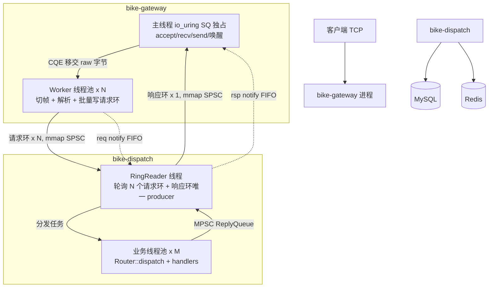

# 模块三：mmap IPC 无锁环 + Dispatch 进程拆分 设计稿

> 状态：**待评审**（评审通过后才进入编码）
> 前置：模块二 Gateway io_uring 已交付并合入（commit `02a4040`），本稿所有接缝均以该版本代码为准。

---

## 0. 文档信息

| 项 | 内容 |
| --- | --- |
| 文档路径 | `docs/superpowers/specs/2026-08-08-ipc-mmap-ring-design.md` |
| 对应任务 | #18（Step 3 设计稿） |
| 依赖设计 | `docs/superpowers/specs/2026-08-08-gateway-io-uring-design.md`（模块二） |
| 范围 | 仅设计，不含任何代码改动 |
| 交付物 | bike-gateway / bike-dispatch 两进程 + `bike_ipc` 库 + 部署改造方案 |

术语约定：

- **Gateway**：io_uring 网关进程（现 `bike-server`，本期改名 `bike-gateway`），只做接入、切帧、编解码搬运。
- **Dispatch**：新独立进程 `bike-dispatch`，承载全部业务逻辑（Router + 12 handlers + MySQL/Redis repo + RideSessionStore）。
- **请求环**：Gateway→Dispatch 方向共享内存 SPSC 环。
- **响应环**：Dispatch→Gateway 方向共享内存 SPSC 环。

---

## 1. 背景与现状

### 1.1 模块二交付的接缝

模块二（commit `02a4040`）在 Gateway 内预留了本期替换点：

1. **`PacketSink` 纯接口**（`server/include/server/gateway/packet_sink.hpp`）：

```cpp
class PacketSink {
public:
    struct Request {
        std::uint64_t conn_id{0};
        std::uint16_t event_id{0};
        std::uint32_t seq{0};
        std::string payload;   // 原始 protobuf 字节
    };
    virtual ~PacketSink() = default;
    // 同步处理并返回完整响应帧(handler 内部已 encode)。
    // 响应 seq 由调用方(UringEngine)用 bike::stamp_seq 回带, 此处不处理。
    // 返回空 = 无响应(单向事件 0x15 / 未注册 eid)。在 worker 线程执行。
    virtual std::vector<std::uint8_t> handle(const Request& req,
                                             bike::server::Ctx& ctx) = 0;
};
```

   头文件注释已写明："Step 3: RingDispatchSink —— 把请求帧写入 mmap SPSC 环，由独立 Dispatch 进程消费；响应经环回流后再走 `OutboxKind::Respond`。接口不变，只换实现。"

2. **`InProcessRouterSink`**（同文件）：当前进程内直连 `Router::dispatch` 的 stub 实现，本期作为**回退模式**保留。

3. **`UringEngine::worker_batch`**（`server/src/gateway/uring_engine.cpp`）：Worker 线程当前流程为
   切帧（`cut_frames`）→ 逐帧 `sink_->handle(req, ctx)` → `bike::stamp_seq(reply, req.seq)` → `outbox_.push(Respond)`；
   异常兜底（catch(...) 记日志丢响应）、坏帧关连接（`cut.bad` → Close）均已就位。

4. **Worker→主线程回传通道**：`OutboxQueue`（纯逻辑 MPSC，跨平台可测）+ `WorkerOutbox`（eventfd 粘合，Linux-only）；主线程通过 io_uring 的 eventfd read SQE（`OpKind::Wakeup`）被唤醒后 `drain_outbox()`。本期**响应环的 Gateway 侧唤醒将复用同一 op 模式**。

### 1.2 现有线程/进程模型

单进程 `bike-server`：

```text
bike-server (单进程)
├── 主线程: io_uring SQ 独占 (accept/recv/send/wakeup/stop, 零解析)
└── ThreadPool × [uring].workers 个 Worker
    └── 切帧 + protobuf 解析 + Router::dispatch(业务) + stamp_seq + outbox
```

业务资产现状（`server/CMakeLists.txt`）：

| 目标 | 内容 | 平台 |
| --- | --- | --- |
| `bike_server_core` | router.cpp + 12 handlers + auth.cpp | 跨平台，无 asio、无 POSIX |
| `bike_server_prod` | mysql_pool/4 repo + redis_session_store | Linux-only（POSIX 头依赖） |
| `bike_gateway_core` | frame_cut.cpp（+ OutboxQueue/PacketSink 头文件） | 跨平台 |
| `bike_server_gateway` | uring_engine.cpp + worker_outbox.cpp | Linux-only |
| `bike-server` | main.cpp（Ctx 装配 + Router 注册 + 引擎启动） | Linux-only |

`main.cpp` 中 Ctx 装配（MysqlPool → 4 repo + RedisSessionStore + RideSessionStore）与 12 个 `register_handler` 目前内联在 `main()`，本期需**拆出共享装配函数**供 `bike-dispatch` 复用。`RideSessionStore` 为内存态会话存储，拆分后归属 Dispatch 单进程，无需跨进程共享。

### 1.3 帧协议 v2 约束（`common/include/bike/protocol.hpp`）

- 帧头 14 字节：magic(4) + eid u16 LE + seq u32 LE + len i32 LE；
- `kMaxMessageLen = 372680`（payload 上限）；
- seq 语义：客户端每连接自增，服务端响应回带原 seq（不配对），现由 `bike::stamp_seq` 原位覆写帧头 [6,10)；
- 单向事件 `0x15 RidePositionReport` 无响应。

### 1.4 前期评估结论

此前对 mmap 共享内存、管道、Unix socket 等 IPC 方案做过测速评估（结论已由用户评审固化）：**mmap 共享内存 + SPSC 无锁环在吞吐与延迟上显著优于内核中转类方案**，故本期 IPC 层严格固化为该方案，不再保留可插拔传输层。

---

## 2. 目标 / 非目标 / 验收

### 2.1 目标

1. **进程隔离**：业务逻辑（含 MySQL/Redis 访问、protobuf 编解码）全部移入独立 Dispatch 进程；Gateway 崩溃不受业务缺陷影响，反之亦然。
2. **IPC 固化**：基于 mmap 的零拷贝 SPSC 无锁环形队列（见 §1.4），请求与响应双向通道。
3. **接缝平滑**：`PacketSink` 接口不变，`ipc.enable=false` 时回退 `InProcessRouterSink`，单机调试与回归不受影响。
4. **性能不回退**：对标模块二基线 **19,925 QPS @ c500**，拆分后不低于基线（允许 ±3% 抖动）；P99 延迟增量 ≤ 0.5ms。
5. **独立扩缩能力**：Gateway 与 Dispatch 具备独立调整副本/资源的能力（本期落地 1:1 绑定拓扑，但接口与部署形态不封死横向扩展，见 §11）。

### 2.2 非目标

- 不改动帧协议 v2 与 protobuf 消息定义；
- 不重写 handlers 业务逻辑（原样复用 `bike_server_core`）；
- 不做 Dispatch 多副本集群/负载均衡（`RideSessionStore` 内存态决定本期 1:1 绑定）;
- 不做零拷贝极致化（handler 签名 `const std::string&` 不动，见 §11 开放问题 O5）；
- 不改客户端。

### 2.3 验收标准

| # | 标准 | 验证方式 |
| --- | --- | --- |
| A1 | bench 压测 ≥ 19,925 QPS@c500 不回退，P99 增量 ≤ 0.5ms | 云端 bench 对标（§10.3） |
| A2 | `kill -9 bike-dispatch` 后 Gateway 在超时窗内关闭存量连接并持续拒绝新业务（不僵死、不脏帧）；dispatch 被 compose 拉起后新连接恢复 | 故障注入演练（§10.2） |
| A3 | `kill -9 bike-gateway` 后 Dispatch 侧心跳检测退出，残留 shm 由后续启动清理 | 故障注入演练 |
| A4 | 全部跨平台单测（环逻辑/报文布局）Windows 本地 ctest 通过；现有 12 项 ctest 不回退 | 本地 ctest |
| A5 | Linux 两进程集成测试：真实 shm 打通，含 seq 回带抽验、单向事件、坏帧关连 | 集成测试（§10.2） |
| A6 | `ipc.enable=false` 回退模式回归通过 | 现有回归用例 |

### 2.4 收益

- **故障隔离**：业务侧 OOM/崩溃（如 handler 缺陷、第三方库异常）不再拖垮接入层；Gateway 保持 accept/close 能力，客户端获得干净的连接重置而非整站失联。
- **独立扩缩**：两进程资源画像解耦（Gateway 高并发轻 CPU，Dispatch 重 CPU/重 IO），可分别限额、分别观测；为后续"多 Gateway 挂一大 Dispatch"或反向形态留口。
- **发布解耦（有限）**：业务变更只重编 Dispatch；但环头版本变更需双进程同步发布（§11 O2）。

---

## 3. 总体架构与拓扑

### 3.1 进程/线程拓扑图



要点：

- **Gateway Worker 线程职责收窄**：只做切帧、帧校验、写请求环、发唤醒；不再执行任何业务逻辑，不再接触 `Ctx`。
- **新增 Dispatch 进程内两个角色**：
  - `RingReader` 线程（1 个）：轮询所有请求环（`pop_batch`）、把任务派给业务线程池、汇集响应并作为**响应环唯一 producer** 批量写环、发响应唤醒；
  - 业务线程池（`[ipc].dispatch_workers` 个，默认 8）：执行 `Router::dispatch`（含 MySQL/Redis IO）。
- **单写者约束全程保持**：每个请求环 producer = 对应 Gateway Worker（唯一）；响应环 producer = RingReader（唯一）。SPSC 前提不被破坏（论证见 §3.3）。

### 3.2 数据流（一次请求-响应）

```text
Client ─TCP─▶ Gateway 主线程 recv ─raw─▶ Worker 切帧/校验
        ─▶ IpcPacket 写入该 Worker 的请求环 (release) ─▶ req notify
        ─▶ Dispatch RingReader pop_batch (acquire) ─▶ 业务线程 dispatch
        ─▶ handler 返回帧(未 stamp) ─▶ ReplyQueue(MPSC, 进程内)
        ─▶ RingReader: stamp_seq(seq 来自 IpcPacket.seq) ─▶ 写响应环 (release) ─▶ rsp notify
        ─▶ Gateway 主线程 drain 响应环 (acquire) ─▶ conn.send_push(已 stamp 完整帧) ─TCP─▶ Client
```

### 3.3 "SPSC vs 多生产者"矛盾的解法

用户硬性要求 SPSC 单生产者单消费者，但拓扑里请求方向有 N 个 Worker、响应方向有 M 个业务线程：

| 方向 | 生产者集合 | 解法 |
| --- | --- | --- |
| 请求环 | N 个 Worker | **per-worker 请求环**：第 i 个 Worker 独占第 i 个请求环，天然 SPSC。Dispatch 的 RingReader 轮询 N 个环。 |
| 响应环 | M 个业务线程 | **汇聚到单写者**：业务线程把完成的响应帧投入进程内 MPSC `ReplyQueue`（复用 `OutboxQueue` 同款 mutex+deque 模式）+ 进程内 eventfd 唤醒；RingReader drain 后统一写响应环。 |

这样环本体严格 SPSC（无 CAS、无 MPMC 开销），多生产者复杂度被隔离在环外，且每侧的汇聚点都是既有成熟模式。

### 3.4 调参项总览

| 参数 | 位置 | 默认 | 说明 |
| --- | --- | --- | --- |
| `[uring].workers` | server.toml | 8 | Gateway Worker 数 = **请求环个数 N** |
| `BIKE_GATEWAY_WORKERS` | 环境变量 | — | 覆盖上项（既有机制保留），环数量随之变化，故修改后需双进程重启 |
| `[ipc].enable` | server.toml | true | false 回退 InProcessRouterSink 单进程模式 |
| `[ipc].shm_root` | server.toml | `/dev/shm` | 共享内存/FIFO 根目录 |
| `[ipc].shm_prefix` | server.toml | `bike` | 文件名前缀，多实例隔离用 |
| `[ipc].req_ring_slots` | server.toml | 512 | 每个请求环槽位数（2 的幂） |
| `[ipc].rsp_ring_slots` | server.toml | 256 | 响应环槽位数（2 的幂） |
| `[ipc].spin_tries` | server.toml | 64 | 读方睡眠前自旋次数 |
| `[ipc].peer_timeout_ms` | server.toml | 5000 | 对端心跳超时（判死） |
| `[ipc].dispatch_workers` | server.toml | 8 | Dispatch 业务线程数 M |

---

## 4. 共享内存总体布局

### 4.1 文件规划

每个 Gateway/Dispatch 配对产生 4 个对象（前缀 `bike`、实例号 `0`）：

| 对象 | 类型 | 用途 |
| --- | --- | --- |
| `/dev/shm/bike0_req.dat` | shm_open 共享内存 | N 个请求环连续排布 |
| `/dev/shm/bike0_rsp.dat` | shm_open 共享内存 | 1 个响应环 |
| `/dev/shm/bike0_req_notify` | 命名管道 FIFO | Gateway→Dispatch 唤醒 |
| `/dev/shm/bike0_rsp_notify` | 命名管道 FIFO | Dispatch→Gateway 唤醒 |

选 shm_open（POSIX 共享内存）而非普通文件映射的理由：语义上即"匿名共享内存"、tmpfs 支撑无磁盘 IO、可按名在双进程间打开、崩溃后以文件形态残留便于检测与清理。FIFO 也放 `/dev/shm` 下统一命名空间（tmpfs 上创建 FIFO 合法），避免挂载额外卷。

**不用"单向双文件拆更细"的方案**（如每 Worker 一个 shm 文件）：文件越多，创建/清理/版本校验的管理面越大；请求环单环仅 2MB，N=16 合计 32MB 放一个文件无压力，且便于原子地整体重初始化。

### 4.2 req.dat 文件布局

```text
偏移        内容
0x0000      ShmFileHeader            (128 B, 1 个缓存行)
0x0080      RingHeader[0]            (128 B)  ← 请求环 0
0x0100      RingHeader[1]            (128 B)
...         RingHeader[N-1]
            ── 4KB 对齐边界 ──
            环 0 槽位区: RingSlot[req_ring_slots]  (槽大小 4096 B)
            环 1 槽位区: ...
            ...
```

### 4.3 rsp.dat 文件布局

```text
0x0000      ShmFileHeader            (128 B)
0x0080      RingHeader               (128 B)
            ── 4KB 对齐边界 ──
            槽位区: RingSlot[rsp_ring_slots]  (槽大小 401408 B, 见 §4.6)
```

### 4.4 槽位结构（定长槽 + payload 内联）

```cpp
// 槽位 = IpcPacket 定长头(32B) + 内联 payload 区。全定长, 下标即偏移, O(1) 定位。
struct RingSlot {
    IpcPacket pkt;                          // 32 B 定长头
    std::uint8_t payload[/* SlotSize - 32 */];   // 编译期: 槽内联 payload 上限
};
static_assert(sizeof(RingSlot) == SlotSize);
```

**定长 vs 变长结论：定长**。变长槽需要空闲链表/位图等分配器进共享内存，崩溃恢复复杂度和锁开销与"无锁"目标冲突；FBEB 业务请求 payload 实际均远小于 1KB，响应侧仅"记录列表类"较大，用两套槽大小即可覆盖，无需变长。

### 4.5 大报文策略：内联上限与溢出处置

帧协议允许 payload 最大 372,680 B，但请求与响应实际画像完全不同，分别处理：

**请求方向（内联上限 3,072 B，槽 4 KB）**

12 类请求 payload 均为小 protobuf（登录码、坐标、ID 类），实测全部 < 1 KB。协议上限 372,680 对请求而言只是"理论天花板"——客户端发来超大请求 payload 即属协议滥用。**策略：payload > `kReqPayloadMax`(3072) 的请求不入环，按坏帧路径关闭连接**（与现有 `cut.bad` 处置同级）。不引入请求溢出区。

**响应方向（内联上限 372,680 B，槽 401,408 B ≈ 392 KB）**

`ListAccountRecordsResponse` / `ListRidesResponse` 在协议上可达 ~364 KB，**不能截断**。策略：响应环槽位直接内联全协议上限，不引入溢出区。

**为什么不做溢出区/辅助共享缓冲**：溢出区意味着"槽位指针→另一块共享内存"的间接层，需要跨进程分配器与回收协议，崩溃恢复面翻倍；而响应环槽位数有限（256），直接放大槽位的总内存开销可预算、可配置，工程上更稳。**零间接、零分配器是本环的硬设计约束。**

### 4.6 容量预算与配置上限论证

设 N = workers = 16（compose 现值），槽数默认：

| 项 | 单槽 | 个数 | 小计 |
| --- | --- | --- | --- |
| 请求环槽位 | 4 KB | 512 × 16 环 | 32 MB |
| 请求环头 | 128 B × 16 + 文件头 | — | ≈ 2 KB |
| 响应环槽位 | 392 KB | 256 | 100 MB（配置上限，见下） |
| **合计** | | | **≈ 132 MB** |

响应环槽数论证：基线 19,925 QPS，Dispatch 侧平均处理 + 排队时间按 5 ms 估，在途响应 ≈ 100；256 槽提供 2.5× 余量。响应环满时的行为见 §8.4（背压），不是崩溃。

**配置上限硬校验**（启动即 fail-fast）：

- `req_ring_slots` / `rsp_ring_slots` 必须为 2 的幂，且 ∈ [64, 4096]；
- 请求槽大小固定 4 KB、响应槽大小固定 401,408 B（v1 版环常量，不可配——可配只会制造双进程不一致）；
- 计算总 shm 需求并写入 `ShmFileHeader.total_bytes`；compose 必须 `shm_size ≥ 总需求 × 1.5`（默认配 256 MB）。**注意：Docker 容器 `/dev/shm` 默认仅 64 MB，不显式配置必然失败**（§11 R1）。

### 4.7 对齐与伪共享规避

- `ShmFileHeader`、`RingHeader` 各占 128 B（2 个 64B 缓存行，为未来 Apple Silicon/部分 ARM 128B 行预留）；
- `RingHeader` 内部 **producer 域与 consumer 域各占一条独立缓存行**：`head`（producer 独写）与 `tail`（consumer 独写）绝不落在同一行，消除 SPSC 最经典的伪共享；
- 槽位区起始 4 KB 对齐（页对齐），槽大小 4 KB / 392 KB 均为 64 的倍数；
- 所有原子量使用 `alignas(std::hardware_destructive_interference_size)` 兜底到 64。

---

## 5. SPSC 无锁协议

### 5.1 head/tail 语义

按用户设计要求，`RingHeader` 中 head/tail 均为 `std::atomic<std::uint32_t>`：

- `head`：**已发布**槽位的单调计数（producer 写）。槽下标 = `head & (slot_count - 1)`。
- `tail`：**已消费**槽位的单调计数（consumer 写）。
- 空判定：`head == tail`；满判定：`head - tail == slot_count`。
- **32 位回绕安全性论证**：uint32 自然回绕下，差值 `head - tail` 按模 2³² 运算，只要任意时刻在途条目数 < 2³¹（环容量 ≤ 4096，远小于该界），满/空判定恒正确。即使以 100 万 QPS 持续运行，回绕周期约 71 分钟/次，判定逻辑不受影响——**32 位在本场景与 64 位等价且满足硬性设计要求**，故不采用 64 位。

### 5.2 写入协议（producer 侧）

```text
两阶段发布, 支持批量:
1. head_local = head.load(relaxed);               // 只有 producer 写 head, relaxed 即可
   tail_snap  = tail.load(acquire);               // 读 consumer 进度, acquire 配对见 §5.4
   if (head_local - tail_snap == slot_count) → 环满
2. 槽位写入阶段(可连续对多个槽): 写 IpcPacket 头 + memcpy payload 到 slot.payload
   —— 此阶段所有写均为普通 store, 尚未发布
3. head.store(head_local + n, release);            // 一次性发布 n 个槽: release 屏障
4. notify_if_needed();                               // 仅当推送前环为空才写 FIFO(§6)
```

`begin_write()` 返回槽指针供就地填充（避免"先构造临时对象再拷贝"的双拷贝），`publish(n)` 一次性推进 head——批量摊薄 release 屏障与唤醒开销。

### 5.3 读取协议（consumer 侧）

```text
1. tail_local = tail.load(relaxed);               // 只有 consumer 写 tail
   head_snap  = head.load(acquire);               // 与 producer 的 publish release 配对
   n = min(batch, head_snap - tail_local);        // n==0 → 空
2. for i in [0, n): 读 slot[i] (IpcPacket + payload)
3. tail.store(tail_local + n, release);            // 归还槽位: release 使槽内写完对 producer 可见
```

consumer 读到的 payload 保证完整：其可见性由 producer `publish` 的 release 屏障担保（acquire-release 同步对，见 §5.4）。

### 5.4 内存屏障正确性论证

| 同步对 | release 端 | acquire 端 | 传递的可见性 |
| --- | --- | --- | --- |
| ① 槽内容 → consumer | `head.store(release)` | `head.load(acquire)` | payload 的全部普通写对 consumer 可见（happens-before） |
| ② 槽归还 → producer | `tail.store(release)` | `tail.load(acquire)` | consumer 对槽的读取完成，producer 可安全覆写 |

- 满/空判定读取对方计数器时均用 acquire，与对方的 release store 配对，形成完整同步环；
- producer 对 head 的 relaxed 本地读、consumer 对 tail 的 relaxed 本地读合法：这两个量各自只有单线程写，无需自同步；
- `IpcPacket` 与 payload 区均不含指针（位置无关，§7.1），不存在跨进程悬垂引用，屏障只需覆盖普通内存写即可。

### 5.5 批量接口

- `push`：单条便捷封装（内部 = begin_write + publish(1)）；
- `begin_write` / `publish(n)`：批量两阶段，Worker 一次 `worker_batch` 切出 k 帧时只做 1 次 release store + 至多 1 次 FIFO 写；
- `pop_batch(out, max)`：一次 acquire load 后连读 ≤ max 槽，只做 1 次 tail release store。RingReader 轮询 N 个请求环时每环一次 `pop_batch`。

### 5.6 mmap 创建 / 打开方式

```text
创建方 (Dispatch, 环的所有者):
  fd = shm_open("/bike0_req.dat", O_CREAT|O_EXCL|O_RDWR, 0600)
     → 若 EEXIST: 打开已有文件做恢复校验(§5.7)
  ftruncate(fd, total_bytes)
  base = mmap(nullptr, total_bytes, PROT_READ|PROT_WRITE, MAP_SHARED, fd, 0)
  close(fd) 后映射仍有效; 就地 placement 初始化 ShmFileHeader/RingHeader
  (std::atomic<uint32_t> 在 x86_64/ARM64 Linux 上布局即 uint32, 共享内存中直接使用;
   初始化时 memset 0 + store(0) 显式归零)

打开方 (Gateway):
  重试循环: shm_open(..., O_RDWR) → ENOENT 则 sleep 100ms 重试(等 Dispatch 就绪),
  上限 [ipc].open_timeout_ms(默认 10s), 超时 fail-fast 退出由 compose 重拉
  fstat 校验大小 == ShmFileHeader.total_bytes 后 MAP_SHARED 映射
```

### 5.7 初始化与崩溃恢复

**判活机制**：`RingHeader.producer_pid` / `consumer_pid` + `heartbeat_ns`（steady_clock 纳秒戳，存活方每 1 s 更新一次；跨进程 steady_clock 同源——同一内核时钟，容器内同样成立）。

**恢复策略表**：

| 场景 | 检测方行为 |
| --- | --- |
| Dispatch 启动发现残留 shm | 读 `ShmFileHeader.magic/version`：不匹配 → `ftruncate` 重建；匹配但 producer_pid 或 consumer_pid 对应进程不存在（`kill(pid,0)` ESRCH）→ 视为陈旧，重建；均存活 → 报错退出（避免双开） |
| Gateway 运行中 Dispatch 心跳超时（> peer_timeout_ms） | 判 Dispatch 死亡：所有存量连接推 Close（客户端重连），停止入环；后台每 1 s 重试打开新环，Dispatch 被 compose 拉起后自动恢复 |
| Dispatch 运行中 Gateway 心跳超时 | RingReader 停止派发（环不会再有新数据），清空 ReplyQueue，等待新 Gateway 打开（心跳归零重建由 Gateway 侧发起） |
| 进程被 kill -9 | 无析构、无锁持有（SPSC 无锁）→ 共享内存状态自洽：最坏丢"已切帧未发布"的半批（head 未推进即不可见），已发布数据完整。**这是选无锁环而非 pthread robust mutex 的核心原因：不存在需要 robust 恢复的锁主** |
| 双进程同时退出后的残留 | 下一次 Dispatch 启动按"残留 shm"行清理；运维兜底：`rm /dev/shm/bike*`（ops.md 记入） |

**magic/version 校验**：`kShmMagic=0x42494B45`（"BIKE"）、`kShmVersion=1`。任何不匹配（含升级）一律重建，不做兼容迁移。

---

## 6. 唤醒机制

### 6.1 候选方案对比

| 方案 | 跨进程可按名打开 | io_uring 可挂 | 延迟 | 开销 | 结论 |
| --- | --- | --- | --- | --- | --- |
| **eventfd** | ✗ 只能 fork 继承或 SCM_RIGHTS 传 fd | ✓ | 最低 | 最低 | **否决**：Gateway 与 Dispatch 无父子关系，fd 传递需引入辅助 socket 握手，复杂度与故障面不值得 |
| **futex** | ✓（futex word 就放在 shm 头里） | ✗ IORING_OP_FUTEX_WAIT 需内核 ≥ 6.7 | 低 | 最低 | **否决为主方案**：Gateway 侧若不能把等待挂进 io_uring，主线程就得专门阻塞/轮询 futex，破坏"主线程只在 CQE 上睡眠"的模型；列为开放问题 O1 跟踪 |
| **忙轮询** | ✓ | — | 最低 | CPU 100% | 单独否决；作为混合策略的快路径保留 |
| **命名管道 FIFO + 自旋退避** | ✓ mkfifo 按名创建 | ✓ read SQE | 接近 eventfd | 极低（空载睡眠） | **采用** |

### 6.2 采用方案：双 FIFO + 自旋退避

两个方向各一条 FIFO（§4.1），通知载荷为 1 字节（内容无意义，仅边沿语义）：

**写方（notify 规则——只在"推送前环为空"时通知一次）**：

```text
was_empty = (head_before == tail_snap);
publish(n);
if (was_empty) { char b = 1; (void)::write(fifo_fd_, &b, 1); }   // EAGAIN 忽略
```

FIFO 以 `O_RDWR | O_NONBLOCK` 打开（读写端同一 fd）：避免无写者时 read 得 ENXIO、避免无读者时 write 得 SIGPIPE/EAGAIN 语义抖动。读端可能积压多字节——无妨，读空即可，通知是"可能有数据"的宽松提示，**正确性不依赖通知**（自旋与周期兜底，见下）。

**读方等待（Dispatch RingReader）**：

```text
loop:
  n = 轮询 N 个请求环 pop_batch → 有数据则处理并重置退避
  无数据: 自旋 spin_tries 次(每次 pause + 重新 pop_batch)
  仍无数据: 阻塞 read(req_notify_fd, buf, 64)   ← 睡眠, CPU 归零
```

**读方等待（Gateway 主线程）**：FIFO 直接挂进 io_uring——新增 `OpKind::RspNotify`，一个常驻 read SQE 指向 `rsp_notify` fd，CQE 到达后读空 FIFO 并 drain 响应环；与现有 `OpKind::Wakeup`（outbox eventfd）完全同构，主循环零改动。**Gateway 侧因此没有任何新增轮询线程或阻塞点。**

**丢通知兜底**：Dispatch RingReader 的阻塞 read 附带超时路径用不到——FIFO 字节会积压不丢；极端情况（对端在 was_empty 判定与 write 之间崩溃）由心跳超时机制兜底（§5.7），不引入周期空轮询。

### 6.3 延迟 / 开销权衡与配置

- `spin_tries=64`：高负载下请求几乎总在自旋窗口内被取走（延迟 ≈ 纯内存访问，<1μs 级）；低负载时快速落入 FIFO 睡眠，空载 CPU ≈ 0；
- 通知频率被"仅空环通知"规则压到最低：持续有流量时 FIFO 完全不写；
- 调参：延迟敏感调大 `spin_tries`（上限 10000），CPU 敏感调小（0 = 纯睡眠，延迟 +~10μs 唤醒开销）。

---

## 7. 核心头文件定义（可评审代码块）

> 说明：以下为设计稿代码，命名空间 `bike::ipc`；落地时头文件位于 `server/include/bike/ipc/`。
> 分层：**ipc_packet.hpp / shm_layout.hpp / spsc_ring.hpp 为纯逻辑、跨平台**（Windows 可编译可单测）；
> shm/fifo 系统调用粘合与 RingSink/RingSource 归 Linux-only 库 `bike_ipc`。

### 7.1 `ipc_packet.hpp` —— 统一报文结构

```cpp
#pragma once

#include <cstdint>

namespace bike::ipc {

// flags 位定义
inline constexpr std::uint16_t kFlagOneWay = 0x1;   // 单向事件(如 0x15), 不期待响应

// 泛化报文单元: 承载任意 FBEB 请求/响应(用户示例 LocationPacket 即 eid=0x16 的一个实例)。
// 定长 32B; 全值语义、无指针(位置无关), 可整体 memcpy 进共享内存槽位。
struct alignas(8) IpcPacket {
    std::uint64_t conn_id{0};      // Gateway 连接 id; 响应环据此回投连接
    std::uint16_t event_id{0};     // FBEB eid (common 枚举常量)
    std::uint16_t flags{0};        // bit0 = kFlagOneWay
    std::uint32_t seq{0};          // 请求 seq 透传; Dispatch 用它 stamp 响应帧 (§8)
    std::uint32_t payload_len{0};  // 槽内联 payload 字节数(紧跟槽头之后)
    std::uint32_t reserved{0};     // 凑齐 32B, 必须写 0(便于将来扩展字段)
};
static_assert(sizeof(IpcPacket) == 32, "IpcPacket must stay 32B");

} // namespace bike::ipc
```

### 7.2 `shm_layout.hpp` —— 元数据头 / 环头 / 槽位

```cpp
#pragma once

#include <atomic>
#include <cstdint>
#include <cstring>

#include "bike/ipc/ipc_packet.hpp"

namespace bike::ipc {

inline constexpr std::uint32_t kShmMagic   = 0x454B4942; // "BIKE"(LE 读序)
inline constexpr std::uint32_t kShmVersion = 1;          // 环布局版本, 不匹配即重建

inline constexpr std::size_t kCacheLine = 64;

// 槽大小(v1 编译期常量, 不可配置, 避免双进程不一致; 论证见设计稿 §4.5/§4.6):
inline constexpr std::size_t kReqSlotSize = 4096;        // 请求环: 内联上限 4064B
inline constexpr std::size_t kRspSlotSize = 401408;      // 响应环: 392KB = 32 + 372680 (4K 对齐)
inline constexpr std::size_t kReqPayloadMax = kReqSlotSize - sizeof(IpcPacket);
inline constexpr std::size_t kRspPayloadMax = kRspSlotSize - sizeof(IpcPacket);

// 文件级元数据头(128B, 独立于任何环): 供打开方在 attach 前完成全部校验。
struct alignas(128) ShmFileHeader {
    std::uint32_t magic{0};
    std::uint32_t version{0};
    std::uint32_t ring_count{0};    // req 文件 = N(worker 数); rsp 文件 = 1
    std::uint32_t slot_count{0};    // 每环槽数(2 的幂)
    std::uint32_t slot_size{0};
    std::uint32_t reserved0{0};
    std::uint64_t total_bytes{0};   // 文件全长(fstat 一致性校验)
    std::uint64_t created_ns{0};    // steady_clock 创建时刻
    std::uint8_t  pad[80];
};
static_assert(sizeof(ShmFileHeader) == 128);

// 环头(128B): producer 域与 consumer 域各占一条缓存行 —— 消除 head/tail 伪共享。
// head/tail 按设计要求为 std::atomic<uint32_t> 单调计数(回绕安全性论证见 §5.1)。
struct RingHeader {
    // ---- producer 独占写域 (缓存行 1) ----
    alignas(kCacheLine) std::atomic<std::uint32_t> head{0};         // 已发布槽位计数
    std::atomic<std::uint32_t> producer_pid{0};
    std::atomic<std::uint64_t> producer_heartbeat_ns{0};            // 每 1s 更新
    std::uint8_t pad0[kCacheLine - 16];

    // ---- consumer 独占写域 (缓存行 2) ----
    alignas(kCacheLine) std::atomic<std::uint32_t> tail{0};         // 已消费槽位计数
    std::atomic<std::uint32_t> consumer_pid{0};
    std::atomic<std::uint64_t> consumer_heartbeat_ns{0};
    std::uint8_t pad1[kCacheLine - 16];
};
static_assert(sizeof(RingHeader) == 128);

// 槽位 = IpcPacket(32B) + 内联 payload。定长: 下标即偏移, 无分配器、无间接层。
template <std::size_t SlotSize>
struct RingSlotT {
    static_assert(SlotSize > sizeof(IpcPacket) && SlotSize % kCacheLine == 0);
    IpcPacket pkt;
    std::uint8_t payload[SlotSize - sizeof(IpcPacket)];
};
static_assert(sizeof(RingSlotT<kReqSlotSize>) == kReqSlotSize);
static_assert(sizeof(RingSlotT<kRspSlotSize>) == kRspSlotSize);

} // namespace bike::ipc
```

### 7.3 `spsc_ring.hpp` —— SPSC 环（模板化容量/槽大小，producer/consumer 视图）

```cpp
#pragma once

#include <algorithm>
#include <cstdint>
#include <cstring>

#include "bike/ipc/shm_layout.hpp"

namespace bike::ipc {

// 单实例 SPSC 无锁环视图。SlotSize/容量均为编译期参数;
// attach 时由外层(ShmRegion)保证 base 指向合法共享内存并校验过文件头。
// 线程约束: Producer 仅在唯一 producer 线程使用, Consumer 仅在唯一 consumer
// 线程使用; 二者之间只通过 head/tail 两个 atomic 通信(协议见设计稿 §5)。
template <std::size_t SlotSize, std::uint32_t SlotCountBits>
class SpscRing {
public:
    static constexpr std::size_t   kSlotSize   = SlotSize;
    static constexpr std::uint32_t kSlotCount  = 1u << SlotCountBits;
    static constexpr std::uint32_t kMask       = kSlotCount - 1;
    static constexpr std::size_t   kPayloadMax = SlotSize - sizeof(IpcPacket);
    using Slot = RingSlotT<SlotSize>;

    // producer 视图: head 的唯一写者
    class Producer {
    public:
        Producer() = default;
        Producer(RingHeader* h, Slot* s)
            : hdr_(h), slots_(s),
              head_local_(h->head.load(std::memory_order_relaxed)) {}

        bool valid() const { return hdr_ != nullptr; }

        // ---- 批量两阶段写入 ----
        // 阶段一: 预订 1 个槽(不推进 head, 可连续调用多次再一次性 publish)。
        // 返回 nullptr = 环满。tail 用 acquire 读: 配对 consumer release, 确认槽已归还。
        Slot* begin_write() {
            const std::uint32_t tail_snap = hdr_->tail.load(std::memory_order_acquire);
            if (head_local_ - tail_snap == kSlotCount) return nullptr;
            return &slots_[head_local_ & kMask];
        }

        // 就地填充槽位(pkt 头 + payload memcpy), 不发布。
        static void fill(Slot* slot, const IpcPacket& pkt, const void* payload) {
            slot->pkt = pkt;
            if (pkt.payload_len > 0)
                std::memcpy(slot->payload, payload, pkt.payload_len);
        }

        // 阶段二: 一次性发布 n 个已顺序填充的槽。
        // release: 槽内全部普通写对执行配对 acquire 的 consumer 可见。
        void publish(std::uint32_t n) {
            head_local_ += n;
            hdr_->head.store(head_local_, std::memory_order_release);
        }

        // ---- 单条便捷接口 ----
        bool push(const IpcPacket& pkt, const void* payload) {
            Slot* slot = begin_write();
            if (slot == nullptr) return false;
            fill(slot, pkt, payload);
            publish(1);
            return true;
        }

        bool full() const {
            const std::uint32_t tail_snap = hdr_->tail.load(std::memory_order_acquire);
            return head_local_ - tail_snap == kSlotCount;
        }
        std::uint32_t size() const {
            const std::uint32_t tail_snap = hdr_->tail.load(std::memory_order_acquire);
            return head_local_ - tail_snap;
        }
        bool empty() const { return size() == 0; }

        // 判活/心跳(§5.7): pid 注册 + 每 1s 由所有者调用
        void register_pid(std::uint32_t pid) { hdr_->producer_pid.store(pid, std::memory_order_relaxed); }
        void heartbeat(std::uint64_t now_ns) { hdr_->producer_heartbeat_ns.store(now_ns, std::memory_order_relaxed); }

    private:
        RingHeader* hdr_{nullptr};
        Slot* slots_{nullptr};
        std::uint32_t head_local_{0};   // 只有本线程写, 本地缓存免 atomic 往返
    };

    // consumer 视图: tail 的唯一写者
    class Consumer {
    public:
        Consumer() = default;
        Consumer(RingHeader* h, Slot* s)
            : hdr_(h), slots_(s),
              tail_local_(h->tail.load(std::memory_order_relaxed)) {}

        bool valid() const { return hdr_ != nullptr; }

        // 一次 acquire 读取: 返回可读槽数(≤max), *out 指向首个可读槽。
        // 注意: 为保证物理连续, 批次不跨越数组回绕点(尾部截断), 下一轮再取。
        std::uint32_t pop_batch(const Slot** out, std::uint32_t max) {
            const std::uint32_t head_snap = hdr_->head.load(std::memory_order_acquire);
            std::uint32_t n = std::min(max, head_snap - tail_local_);
            const std::uint32_t to_end = kSlotCount - (tail_local_ & kMask);
            n = std::min(n, to_end);
            if (n == 0) return 0;
            *out = &slots_[tail_local_ & kMask];
            return n;
        }

        // 归还 n 个已读取的槽。release: 保证读取完成发生在 producer 覆写之前。
        void release(std::uint32_t n) {
            tail_local_ += n;
            hdr_->tail.store(tail_local_, std::memory_order_release);
        }

        bool empty() const {
            const std::uint32_t head_snap = hdr_->head.load(std::memory_order_acquire);
            return head_snap == tail_local_;
        }

        void register_pid(std::uint32_t pid) { hdr_->consumer_pid.store(pid, std::memory_order_relaxed); }
        void heartbeat(std::uint64_t now_ns) { hdr_->consumer_heartbeat_ns.store(now_ns, std::memory_order_relaxed); }

    private:
        RingHeader* hdr_{nullptr};
        Slot* slots_{nullptr};
        std::uint32_t tail_local_{0};
    };
};

// v1 编译期实例化(与 §4.6 容量预算一致; 槽数配置项必须与之一致, 见 §9.3):
using ReqRing = SpscRing<kReqSlotSize, 9>;   // 512 槽/环, 单环 2MB
using RspRing = SpscRing<kRspSlotSize, 8>;   // 256 槽, 单环 100MB

} // namespace bike::ipc
```

### 7.4 Gateway 侧粘合：`RingSink`（实现 PacketSink）

```cpp
#pragma once

// Linux-only: 请求环写入粘合层。纯逻辑环见 spsc_ring.hpp。

#include <atomic>
#include <stdexcept>
#include <vector>

#include "bike/ipc/spsc_ring.hpp"
#include "server/gateway/packet_sink.hpp"

namespace bike::ipc {

// 请求环满 / 报文超限: 由 UringEngine::worker_batch 捕获并关闭该连接(fail-fast)。
class SinkOverload : public std::runtime_error {
public: SinkOverload() : std::runtime_error("ipc request ring full") {}
};
class MalformedIpcRequest : public std::runtime_error {
public: MalformedIpcRequest() : std::runtime_error("payload exceeds kReqPayloadMax") {}
};

// Step 3 sink: 每个 Gateway Worker 线程独占一个请求环 producer(§3.3)。
// handle() 语义变为"异步入环": 成功立即返回空帧(网关不再同步等响应),
// 响应经响应环回流后由主线程走 send 路径(§8)。PacketSink 接口不变。
class RingSink final : public bike::gateway::PacketSink {
public:
    // pool = N 个已 attach 的请求环 Producer; notify_fd = req_notify FIFO(O_RDWR|O_NONBLOCK)。
    RingSink(std::vector<ReqRing::Producer> pool, int notify_fd);

    std::vector<std::uint8_t> handle(const Request& req,
                                     bike::server::Ctx& ctx) override {
        (void)ctx;   // 网关侧不再接触业务上下文
        ReqRing::Producer& p = bind_producer();   // thread_local 首次绑定, 见下

        IpcPacket pkt;
        pkt.conn_id     = req.conn_id;
        pkt.event_id    = req.event_id;
        pkt.flags       = (req.event_id == bike::event_id(bike::Event::RidePositionReport))
                              ? kFlagOneWay : 0;
        pkt.seq         = req.seq;
        pkt.payload_len = static_cast<std::uint32_t>(req.payload.size());
        if (pkt.payload_len > ReqRing::kPayloadMax) throw MalformedIpcRequest();

        const bool was_empty = p.empty();
        ReqRing::Slot* slot = p.begin_write();
        if (slot == nullptr) throw SinkOverload();   // 环满: 关连接, 客户端重连
        ReqRing::Producer::fill(slot, pkt, req.payload.data());
        p.publish(1);
        if (was_empty) notify();                     // 1B write, EAGAIN 忽略(§6.2)
        return {};                                   // 空 = 无同步响应
    }

private:
    // Worker 线程数 = [uring].workers = 请求环数 N。thread_local 首次绑定池下标,
    // 池耗尽(线程数超配) → 致命错误: 启动配置不一致, 直接抛出终止该线程任务流。
    ReqRing::Producer& bind_producer();
    void notify();

    std::vector<ReqRing::Producer> pool_;
    int notify_fd_{-1};
    std::atomic<std::uint32_t> next_idx_{0};
};

} // namespace bike::ipc
```

### 7.5 Dispatch 侧粘合：`RingSource`（读请求环组）

```cpp
#pragma once

// Linux-only: Dispatch 侧请求环组读取 + FIFO 自旋等待(§6.2)。

#include <chrono>
#include <cstdint>
#include <functional>
#include <vector>

#include "bike/ipc/spsc_ring.hpp"

namespace bike::ipc {

// 轮询 N 个请求环的唯一 reader(RingReader 线程持有)。
// 等待策略: 轮询 → 自旋 spin_tries 次 → 阻塞 read(req_notify fd); 通知仅是提示,
// 正确性由环自身 head/tail 保证, 不会因丢通知而永久睡眠(字节在 FIFO 积压不丢)。
class RingSource {
public:
    RingSource(std::vector<ReqRing::Consumer> rings, int notify_fd,
               std::uint32_t spin_tries);

    // 阻塞至至少取到 1 个报文, 或心跳判定对端超时。
    // cb(pkt, payload_view) 逐包交付; 返回本轮交付总数。
    using Callback = std::function<void(const IpcPacket& pkt,
                                        const std::uint8_t* payload,
                                        std::size_t len)>;
    std::uint32_t wait_pop(const Callback& cb,
                           std::chrono::milliseconds peer_timeout);

    // 对端(Gateway)判活: 任一请求环 producer 心跳新于 timeout 即视为存活
    bool producer_alive(std::chrono::milliseconds timeout) const;

private:
    std::uint32_t poll_round(const Callback& cb);   // 轮询所有环各一次 pop_batch

    std::vector<ReqRing::Consumer> rings_;
    int notify_fd_{-1};
    std::uint32_t spin_tries_{64};
};

} // namespace bike::ipc
```

### 7.6 `bike-dispatch` 装配草图（DispatchMain）

```cpp
// server/src/dispatch_main.cpp —— bike-dispatch 入口(落地时的结构草图)
int main(int argc, char** argv) {
    // 1. 配置与日志: 复用 load_config; [log].file 指向 /var/log/bike-dispatch/
    bike::server::Config cfg = load_config(argv[1]);
    bike::server::init_logging(cfg.log.level, cfg.log.file);

    // 2. 共享内存: 创建或恢复(§5.7 策略表)。Dispatch 是环的所有者。
    bike::ipc::ShmRegion region(cfg.ipc);                 // req.dat + rsp.dat
    region.create_or_recover(/*workers=*/cfg.uring.workers);
    auto req_consumers = region.attach_req_consumers();   // N 个 ReqRing::Consumer
    auto rsp_producer  = region.attach_rsp_producer();    // 1 个 RspRing::Producer

    // 3. FIFO: mkfifo(bike{N}_req_notify / rsp_notify) + O_RDWR|O_NONBLOCK 打开
    bike::ipc::FifoChannel req_notify(...), rsp_notify(...);

    // 4. 业务装配 —— 从 bike-server 的 main.cpp 抽出的共享函数(bike_server_app):
    bike::server::Ctx ctx = bike::server::make_prod_ctx(cfg);   // MySQL/Redis/RideSession
    bike::server::Router router;
    bike::server::register_all_handlers(router);                // 12 个 eid

    // 5. 业务线程池 + 响应汇聚(MPSC ReplyQueue + 进程内 eventfd, 复用 OutboxQueue 模式)
    bike::server::ThreadPool biz(cfg.ipc.dispatch_workers);
    bike::ipc::ReplyQueue replies;                       // push(业务线程) / drain(RingReader)

    // 6. RingReader 线程主循环(响应环唯一 producer):
    bike::ipc::RingSource source(std::move(req_consumers), req_notify.fd(),
                                 cfg.ipc.spin_tries);
    std::atomic<bool> stopping{false};
    std::thread reader([&] {
        while (!stopping.load(std::memory_order_acquire)) {
            // 6a. 收请求 → 派业务任务(handler 返回未 stamp 帧, seq 随 pkt 透传)
            source.wait_pop([&](const bike::ipc::IpcPacket& pkt,
                                const std::uint8_t* p, std::size_t n) {
                bike::ipc::ReplyItem item;
                item.conn_id = pkt.conn_id;
                item.seq     = pkt.seq;
                item.one_way = pkt.flags & bike::ipc::kFlagOneWay;
                biz.post([&router, &ctx, payload = std::string((const char*)p, n),
                          eid = pkt.event_id, item]() mutable {
                    item.frame = router.dispatch(eid, payload, ctx);
                    if (!item.frame.empty() && !item.one_way)
                        bike::stamp_seq(item.frame, item.seq);  // stamp 迁移至此(§8)
                    replies.push(std::move(item));              // + eventfd 唤醒 reader
                });
            }, std::chrono::milliseconds(cfg.ipc.peer_timeout_ms));

            // 6b. 汇集响应 → 批量写响应环(release) → 仅空环时 notify
            std::vector<bike::ipc::ReplyItem> done;
            replies.drain(done);
            const bool was_empty = rsp_producer.empty();
            std::uint32_t staged = 0;
            for (auto& it : done) {
                if (it.frame.empty()) continue;                 // 单向/未注册 eid
                auto* slot = rsp_producer.begin_write();
                while (slot == nullptr) {                       // 响应环满: 自旋等, 不丢弃(§8.4)
                    if (stopping.load(std::memory_order_relaxed)) break;
                    slot = rsp_producer.begin_write();
                }
                if (slot == nullptr) break;
                bike::ipc::IpcPacket rpkt;
                rpkt.conn_id = it.conn_id;
                rpkt.payload_len = static_cast<std::uint32_t>(it.frame.size());
                bike::ipc::RspRing::Producer::fill(slot, rpkt, it.frame.data());
                ++staged;
            }
            if (staged) rsp_producer.publish(staged);
            if (was_empty && staged) rsp_notify.write1();

            // 6c. 每 1s: 更新 consumer 心跳; Gateway 心跳超时 → 停派发等重连(§5.7)
        }
    });

    // 7. sigaction(SIGTERM/SIGINT) → stopping + eventfd; 逆序 join reader/biz;
    //    shm 不主动 unlink: 由下次启动的恢复逻辑清理, 避免对端尚在映射期 unlink。
}
```

---

## 8. 响应路径与 stamp_seq 归属重设计

### 8.1 现状

模块二中 `stamp_seq` 发生在 **Gateway Worker 线程**（`worker_batch`）：`sink_->handle()` 同步返回 handler 已编码、seq=0 的帧 → Worker 用请求 seq 原位覆写帧头 [6,10) → `outbox_.push(Respond)` → 主线程 send。

### 8.2 拆分后归属：stamp_seq 迁移至 Dispatch（采纳建议方案）

**结论：seq 由 IpcPacket.seq 随请求入环透传至 Dispatch；handler 返回帧（seq=0）由 Dispatch 在写入响应环之前 stamp；响应环承载"完整可发送帧"，Gateway 主线程 drain 后零解析直接投递发送队列。**

论证：

1. **信息就近**：seq 已随 `IpcPacket` 到达 Dispatch，handler 帧与 seq 同处一进程，stamp 只是 4 字节覆写，零额外传输成本。若留在 Gateway stamp，响应环必须额外携带 seq 字段且 Gateway 需解析帧头定位 [6,10)——违背模块二"主线程零解析"原则。
2. **网关更薄**：Gateway 主线程对响应环的处理退化为 `conn.send_push(bytes)`，与 accept/recv/send 同构；Worker 侧也不再需要 `bike::stamp_seq`。
3. **正确性**：`stamp_seq` 失败（帧 <14B）语义不变——Dispatch 侧记错误日志并丢弃该响应帧，绝不发脏帧；与原 `worker_batch` 行为一一对应。
4. **回退兼容**：`ipc.enable=false` 时走现有 `InProcessRouterSink` 路径，`worker_batch` 的 stamp 逻辑原样保留，双模式互不影响。

### 8.3 Gateway 主线程响应 drain

- 新增 `OpKind::RspNotify`：常驻 read SQE 挂 `rsp_notify` FIFO，CQE 到达 → 读空 FIFO → `drain_response_ring()`；
- **兜底**：主循环每轮（含 wait_cqe_timeout 超时轮）顺带调用一次 `drain_response_ring()`——单次 `pop_batch` 空环代价仅一次 acquire load，换取"通知丢失也不滞留"的强保证；
- `drain_response_ring()`：`pop_batch` → 逐包 `conns_.find(conn_id)`（已关闭连接丢弃，与现 `drain_outbox` 同款语义）→ `send_push(payload)` → 未武装则 `submit_send` → `release`。

### 8.4 背压与失败语义对照表

| 故障点 | 进程内模式（现状） | 拆分后 |
| --- | --- | --- |
| 请求方向过载（请求环满） | 不存在（同步调用） | `SinkOverload` → 关闭该连接（客户端自动重连）；记指标 |
| 请求 payload > 4064B | 不存在 | `MalformedIpcRequest` → 关闭连接（协议滥用防护） |
| handler 异常 | Worker catch → 丢响应 | Dispatch 业务任务内 catch → 丢响应（行为一致） |
| 响应方向过载（响应环满） | 不存在 | RingReader 自旋重试 `begin_write`（不丢弃响应），ReplyQueue 积压反压业务线程；根因是 Gateway 发送停滞，由心跳/连接排空机制收敛 |
| Dispatch 进程死亡 | — | Gateway 心跳超时 → 存量连接 Close + 拒新业务，后台重开环等待恢复（§5.7） |
| Gateway 进程死亡 | — | Dispatch 停派发，等待新 Gateway；compose 重拉 |

---

## 9. 进程拓扑与部署

### 9.1 CMake 目标划分（`server/CMakeLists.txt` 改造）

```cmake
# ---- IPC 纯逻辑库 (跨平台, Windows 可单测) ----
# ipc_packet/shm_layout/spsc_ring 均为头文件; reply_queue 复用 OutboxQueue 同款模式。
add_library(bike_ipc_core INTERFACE)
target_include_directories(bike_ipc_core INTERFACE include)

# ---- IPC Linux 粘合层: shm_open/mmap + FIFO + RingSink/RingSource ----
if(CMAKE_SYSTEM_NAME STREQUAL "Linux")
    add_library(bike_ipc STATIC
        src/ipc/shm_region.cpp        # create_or_recover / attach (§5.6/§5.7)
        src/ipc/fifo_channel.cpp      # mkfifo + O_RDWR|O_NONBLOCK
        src/ipc/ring_sink.cpp         # RingSink::bind_producer/notify
        src/ipc/ring_source.cpp       # wait_pop 自旋/睡眠循环
    )
    target_link_libraries(bike_ipc PUBLIC bike_ipc_core bike_gateway_core rt)
endif()

# ---- 业务装配共享库: 从 main.cpp 抽出 make_prod_ctx + register_all_handlers ----
if(CMAKE_SYSTEM_NAME STREQUAL "Linux")
    add_library(bike_server_app STATIC src/app/ctx_factory.cpp)
    target_link_libraries(bike_server_app PUBLIC bike_server_core bike_server_prod)
endif()

# ---- 两个可执行文件 (Linux) ----
if(CMAKE_SYSTEM_NAME STREQUAL "Linux")
    add_executable(bike-gateway  src/gateway_main.cpp)   # 由 bike-server 演化(改名)
    target_link_libraries(bike-gateway PRIVATE bike_server_gateway bike_ipc bike_server_app)

    add_executable(bike-dispatch src/dispatch_main.cpp)
    target_link_libraries(bike-dispatch PRIVATE bike_server_app bike_ipc)
endif()

# ---- 新增测试(跨平台部分) ----
add_executable(test_spsc_ring tests/test_spsc_ring.cpp)       # 纯逻辑环
target_link_libraries(test_spsc_ring PRIVATE bike_ipc_core GTest::gtest_main)
add_executable(test_ipc_packet tests/test_ipc_packet.cpp)     # 布局/回环
target_link_libraries(test_ipc_packet PRIVATE bike_ipc_core GTest::gtest_main)
```

复用关系：`bike-dispatch` 链接 `bike_server_app → bike_server_core(router/handlers/auth) + bike_server_prod(mysql/redis)`，业务资产零重写；`bike-gateway` 链接既有 `bike_server_gateway`（uring 引擎），仅在 main 中按 `[ipc].enable` 选择 sink 实现。

### 9.2 docker-compose 改造

关键约束：**两个容器的 `/dev/shm` 彼此隔离**，必须用共享卷把 shm 文件/FIFO 放进同一命名空间。采用 `tmpfs` 驱动的命名卷挂载到双方 `/dev/shm`（内存文件系统，尺寸显式受控，规避容器默认 64MB 限制）：

```yaml
  bike-dispatch-1:
    build: { context: .., dockerfile: docker/Dockerfile.server }
    container_name: bike-dispatch-1
    depends_on:
      mysql: { condition: service_healthy }
      redis: { condition: service_healthy }
    volumes:
      - ./server.toml:/etc/bike/server.toml:ro
      - bike-shm-1:/dev/shm                      # 与 gateway 共享同一 shm 空间
      - dispatch-logs-1:/var/log/bike-dispatch
    healthcheck:                                 # 心跳文件新鲜度(dispatch 每 1s touch)
      test: ["CMD-SHELL", "test -f /var/log/bike-dispatch/alive && find /var/log/bike-dispatch/alive -mmin -0.1 | grep -q ."]
      interval: 5s
      timeout: 3s
      retries: 10
    restart: unless-stopped

  bike-server-1:                                 # gateway(容器名暂保留, 二进制为 bike-gateway)
    depends_on: [mysql, redis]                   # dispatch 先起非硬依赖: 环打开有 10s 重试
    shm_size: 256m                               # 兜底自身 /dev/shm(卷挂载为主路径)
    volumes:
      - ./server.toml:/etc/bike/server.toml:ro
      - bike-shm-1:/dev/shm
      - server-logs-1:/var/log/bike-server
    # ... 其余同现状(BIKE_GATEWAY_WORKERS: "16" 等)

volumes:
  bike-shm-1:
    driver: local
    driver_opts: { type: tmpfs, device: tmpfs, o: "size=268435456" }   # 256MB ≥ 132MB×1.5
```

启动顺序与健康检查要点：

- **Dispatch 先启**（环的所有者）；Gateway 侧 `shm_open` 重试循环（10s 上限）天然吸收启动时序差，故不引入强 condition 依赖；
- 两进程 `restart: unless-stopped`，互挂互拉（心跳判死见 §5.7）；
- 双实例场景：`bike-shm-1/2` 各自独立卷，天然隔离；
- `BIKE_GATEWAY_WORKERS` 变更后**必须成对重启**该实例的 gateway 与 dispatch（环数 N 是布局参数，§11 R5）。

### 9.3 server.toml 新增 `[ipc]` 段

```toml
# IPC 环 (模块三)。enable=false 时回退进程内 InProcessRouterSink(单进程模式)。
[ipc]
enable = true
shm_root = "/dev/shm"          # shm 文件与 FIFO 根目录
shm_prefix = "bike"            # 文件名: {prefix}{instance}_req.dat 等
open_timeout_ms = 10000        # Gateway 等待 Dispatch 建环的上限
peer_timeout_ms = 5000         # 对端心跳超时(判死)
spin_tries = 64                # 读方睡眠前自旋次数(0=纯睡眠, 10000=极限低延迟)
dispatch_workers = 8           # Dispatch 业务线程数 M
# req_ring_slots / rsp_ring_slots: v1 为编译期常量(ReqRing=512, RspRing=256),
# 配置值必须与常量一致, 不一致启动即报错 —— 防止双进程布局错位。
req_ring_slots = 512
rsp_ring_slots = 256
```

配置读取：`bike_server_config` 新增 `IpcConfig` 段解析与校验（2 的幂、区间 [64,4096]、与编译期常量一致性、总 shm 预算输出到启动日志）。

### 9.4 日志与可观测

- Dispatch 独立日志目录 `/var/log/bike-dispatch/`（compose 独立卷）；
- 关键指标日志（INFO 级周期汇总）：请求环水位峰值、响应环水位峰值、SinkOverload 关连次数、ReplyQueue 深度峰值、对端心跳超时事件；
- 双进程均可通过现有 `[log].level` 独立调级。

---

## 10. 测试策略

### 10.1 跨平台纯逻辑单测（Windows 本地 ctest）

| 测试目标 | 用例 |
| --- | --- |
| `test_ipc_packet` | `sizeof(IpcPacket)==32`、`ShmFileHeader/RingHeader==128`、槽模板 static_assert；IpcPacket 全字段回环 |
| `test_spsc_ring` | 空/满判定；push→pop 数据一致；批量两阶段（begin_write×k→publish(k)）；**回绕用例**：小容量环（测试专用 `SpscRing<128,3>`）连续写读 10⁵ 次验证 uint32 差值语义；pop_batch 回绕点截断行为；多线程 SPSC 压力（2 线程 × 10⁶ 条，payload 校验和比对）——纯 C++ atomic，Windows/Linux 均可跑 |
| 既有 12 项 | 全量保留不回退（config/handlers×2/ride_session/frame_cut/outbox/router_sink） |

关键设计：`SpscRing` 不依赖 mmap——attach 的 base 指针可指向任何内存，单测直接 `new RingHeader + Slot[]` 即可在 Windows 上完整验证无锁协议。

### 10.2 Linux 集成测试（两进程真实 mmap 打通）

`ipc_e2e_test`（Linux-only，Dockerfile.test 内执行）：

1. **fork 双进程打通**：子进程扮演 Dispatch（create shm + Consumer/Producer），父进程扮演 Gateway（open + RingSink 写 1000 请求 / drain 响应环），断言全量一致、seq 回带正确；
2. **FIFO 唤醒路径**：空环睡眠 → 写入 → 被唤醒（延迟上限断言 <50ms）；
3. **崩溃恢复**：kill -9 子进程 → 父进程心跳超时检测；父进程退出后残留 shm → 再次启动走 `create_or_recover` 重建成功；
4. **协议行为抽验**：单向事件（0x15）无响应帧回环；坏帧关连路径（构造超大 payload 触发 MalformedIpcRequest）；
5. 完整 handler 链路：`bike-dispatch` 真实进程 + mock 客户端 TCP → `bike-gateway`，覆盖登录/上报/结束行程三类典型。

### 10.3 压测（云端，对标基线）

- 工具与场景与模块二基线一致：**目标 ≥ 19,925 QPS @ c500，P99 不回退 + ≤0.5ms 增量**；
- 分档观测 IPC 引入的延迟增量：① `ipc.enable=false`（回退，基线复测）② `enable=true` + `spin_tries=64` ③ `spin_tries=0`；
- 长稳 30 min：shm 水位、心跳、内存占用（RSS）无漂移；
- 故障注入：压测中途 `kill -9 bike-dispatch`，观察 Gateway 关连/恢复时间窗（验收 A2）。

---

## 11. 风险与开放问题

### 11.1 风险（含缓解）

| # | 风险 | 缓解 |
| --- | --- | --- |
| R1 | **容器 `/dev/shm` 默认仅 64MB**，环总需求 ≈132MB，默认配置必然 mmap 失败 | compose 显式 tmpfs 卷 + `o: size=256m`；Dispatch 启动时 `ftruncate` 失败即报清晰错误（含需求值）；ops.md 记入 |
| R2 | 容器化 `shm_open` 权限/命名空间：跨容器不可见 | 不依赖各容器私有 /dev/shm：统一挂载 tmpfs 卷到 `/dev/shm`；`shm_open` 本质是按路径 open，卷内路径即共享命名空间，无需额外 capability |
| R3 | **"零拷贝"真实性边界**：payload 并非零次拷贝 | 诚实界定——"零拷贝"指**无内核中转（无 socket/管道 IPC 拷贝、无系统调用搬运数据）**。payload 拷贝路径：切帧→Request.payload（1 次，既有）、入请求环（1）、Dispatch 交 handler（1，`const std::string&` 签名约束）、响应帧入响应环（1）、出环入 send 队列（1）。每方向净增 2 次 memcpy，均为纯内存带宽开销（ns/字节级）；相比模块二进程内路径，真正省下的是跨进程内核往返 |
| R4 | 请求环满即关连接，突发洪峰可能放大重连 | 512 槽 × 16 环对 19,925 QPS 有充足余量（平均在途 ~100）；关连是协议层最干净的背压信号（客户端指数退避重连）；指标监控 SinkOverload 次数，异常可调大槽数常量（下版本） |
| R5 | `[uring].workers`/`BIKE_GATEWAY_WORKERS` 变更会改变环数 N，单侧重启导致布局错位 | 启动校验：Gateway attach 时比对 `ShmFileHeader.ring_count` 与本地 N，不一致 fail-fast；compose 变更文档注明成对重启 |
| R6 | 跨进程 steady_clock 同源性假设 | Linux 同一内核（含容器）steady_clock 同源成立；心跳仅作粗粒度判活（秒级），不做时钟精确同步用途，风险可接受 |

### 11.2 开放问题（不阻塞本期）

- **O1 futex 升级路径**：内核 ≥6.7 后可评估 `IORING_OP_FUTEX_WAIT` 把等待直接挂进 io_uring（futex word 置 RingHeader 保留位），替换 FIFO 通知；接口层（notify/wait 已抽象）无需大改。
- **O2 滚动升级**：`kShmVersion` 变更需双进程同发；未来如需独立发布 Dispatch，需版本协商握手（本期不做，compose 统一镜像版本即可）。
- **O3 单容器双进程备选**：若共享 tmpfs 卷在生产环境遇运维限制，备选为单容器内 supervisor 拉起两进程（进程隔离收益保留，仅失去容器级隔离），代码零差异。
- **O4 多 Gateway → 单 Dispatch**：当前请求环所有权模型（per-worker）天然可扩展为 per-(gateway,worker)，`shm_prefix` 已预留实例维度；但 RideSessionStore/会话亲和性需另行设计，本期 1:1。
- **O5 handler 签名真零拷贝化**：`HandlerFn(const std::string&, Ctx&)` 改为 `std::span<const uint8_t>` 可再省 1 次拷贝，涉及 12 handlers 与测试，留作独立小任务。

---

## 12. 实施拆分建议（评审通过后）

| 阶段 | 内容 | 验证门槛 |
| --- | --- | --- |
| S1 | `bike_ipc_core` 三个头文件 + `test_ipc_packet` / `test_spsc_ring` | Windows ctest 全绿（含既有 12 项） |
| S2 | `bike_ipc` Linux 粘合（shm_region/fifo/ring_sink/ring_source）+ `ipc_e2e_test` | Docker 内集成测试通过 |
| S3 | `bike_server_app` 抽取（main.cpp 拆装配）+ `bike-gateway` 接线（sink 选择 + 响应 drain + RspNotify op） | 回退模式回归不回退 |
| S4 | `bike-dispatch` 装配 + compose/toml/Dockerfile 改造 | 云端两进程打通 + 故障注入 |
| S5 | 压测对标 + ops.md/配置文档更新 | A1-A6 验收全过 |

---

（完）

